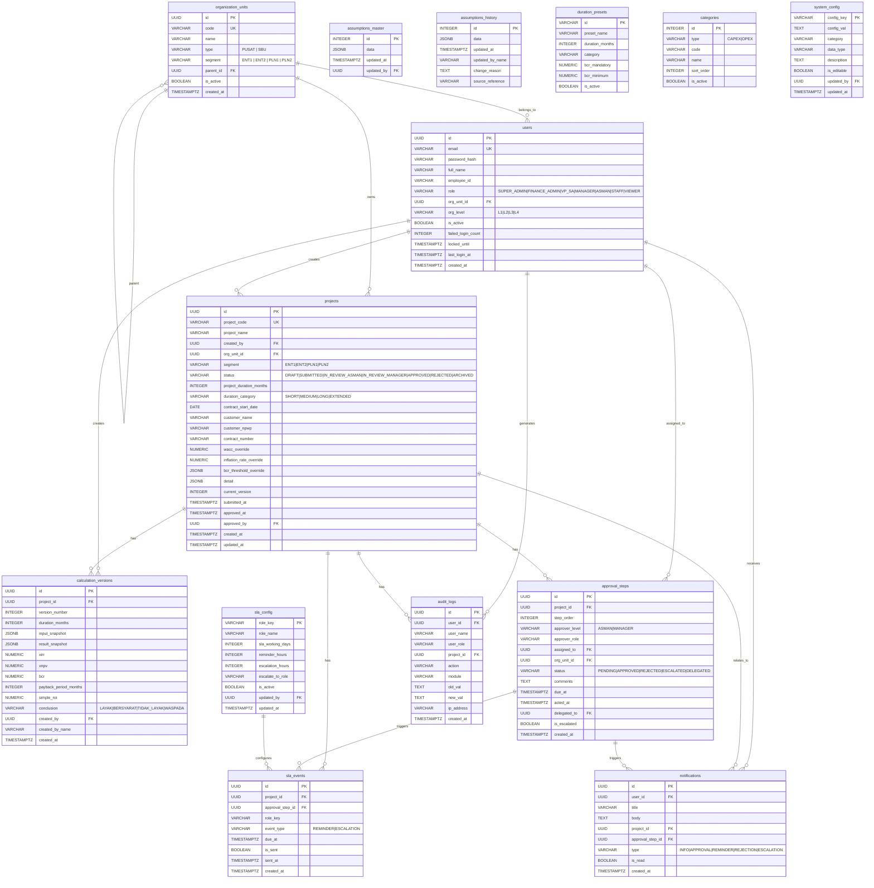

# BUSINESS REQUIREMENTS & ARCHITECTURE DOCUMENT
## NAVPRO — Kajian Kelayakan Finansial (KKF)
### Revisi Hierarki Organisasi & Approval Workflow

> **Versi:** 2.0 | **Status:** Final Draft | **Tanggal:** 28 Mei 2026
> **Entitas:** ICON+ (PT Indonesia Comnets Plus) — PLN Group
> **Klasifikasi:** Internal Confidential

---

## DAFTAR ISI

1. [Executive Summary](#1-executive-summary)
2. [Konteks Bisnis & Latar Belakang](#2-konteks-bisnis--latar-belakang)
3. [Struktur Organisasi Revisi](#3-struktur-organisasi-revisi)
4. [Hierarki Approval & Business Process](#4-hierarki-approval--business-process)
5. [Role & Permission Matrix](#5-role--permission-matrix)
6. [Business Rules](#6-business-rules)
7. [Entity Relationship Diagram (ERD)](#7-entity-relationship-diagram-erd)
8. [Data Flow Diagram (DFD)](#8-data-flow-diagram-dfd)
9. [Database Schema & Relasi](#9-database-schema--relasi)
10. [API Endpoint Mapping](#10-api-endpoint-mapping)
11. [Workflow State Machine](#11-workflow-state-machine)
12. [Notification Matrix](#12-notification-matrix)
13. [SLA Configuration](#13-sla-configuration)
14. [KPI & Metrics](#14-kpi--metrics)
15. [Risiko & Mitigasi](#15-risiko--mitigasi)

---

## 1. Executive Summary

NAVPRO adalah platform web enterprise untuk mendigitalisasi proses **Kajian Kelayakan Finansial (KKF)** di ICON+ — menggantikan proses berbasis Excel manual menjadi sistem terintegrasi dengan kalkulasi otomatis, workflow approval digital multi-level, dan dashboard eksekutif real-time.

**Perubahan Utama v2.0:** Revisi hierarki organisasi menyesuaikan struktur aktual Bidang Solution Architect yang terdiri dari 4 sub-bidang (Enterprise 1, Enterprise 2, PLN 1, PLN 2) dengan unit-unit SBU regional di bawahnya, serta penyesuaian alur approval dari Staff → Asman → Manager Segment.

| Parameter | Nilai |
|---|---|
| Entitas | ICON+ / PLN Group |
| Scope | KKF Proyek Investasi (1 Tahun & Multi-Tahun) |
| Target Users | 50+ pengguna simultan |
| Approval Levels | 3 level (Staff → Asman → Manager) |
| Unit Organisasi | 4 Pusat + 9 SBU Regional |
| Tech Stack | Node.js + Express, Static HTML/JS, PostgreSQL |

---

## 2. Konteks Bisnis & Latar Belakang

### 2.1 Problem Statement

| ID | Masalah | Dampak Bisnis |
|---|---|---|
| P-01 | File Excel tersebar tanpa version control | Risiko keputusan investasi berbasis data salah |
| P-02 | Asumsi WACC/BCR tidak konsisten antar file | Pelanggaran kebijakan DirKeu |
| P-03 | Tidak ada audit trail perubahan formula | Non-compliant dengan internal audit PLN Group |
| P-04 | Approval manual via kertas & email | SLA tidak terukur, tidak ada eskalasi otomatis |
| P-05 | Zero visibilitas eksekutif | Manajemen tidak dapat memantau pipeline proyek |
| P-06 | Fragmentasi data lintas unit SBU | Tidak ada agregasi portofolio regional |

### 2.2 Financial Governance Parameters

| Parameter | Nilai | Sumber |
|---|---|---|
| WACC Annual | 9,72% p.a. | Memo VP Keuangan April 2026 |
| BCR Mandatory | ≥ 1,23 | Memo DirKeu 16 Sep 2025 |
| BCR Minimum | ≥ 1,08 | Memo DirKeu 16 Sep 2025 |
| Inflasi Bulanan Default | 0,3% per bulan | Assumption Master |
| Durasi Proyek | 1–120 bulan | System Config |
| Formula XIRR | Newton-Raphson (max 1000 iter, tol 1e-7) | Calculation Engine |

---

## 3. Struktur Organisasi Revisi

### 3.1 Hierarki Organisasi

```
L1: VP Solution Architect
│
├── L2: Manager Solution Architect PLN 1
│   ├── L3: Asman Solar Jar & Infra PLN 1
│   │   └── L4: Staff Solution Architect (PLN 1 - Infra)
│   └── L3: Asman Solar Digital & Green Solution PLN 1
│       └── L4: Staff Solution Architect (PLN 1 - Digital)
│
├── L2: Manager Solution Architect PLN 2
│   ├── L3: Asman Solar Jar & Infra PLN 2
│   │   └── L4: Staff Solution Architect (PLN 2 - Infra)
│   └── L3: Asman Solar Digital & Green Solution PLN 2
│       └── L4: Staff Solution Architect (PLN 2 - Digital)
│
├── L2: Manager Solution Architect Enterprise 1
│   ├── L3: Asman Solar Jar & Infra Enterprise 1
│   │   └── L4: Staff Solution Architect (Ent 1 - Infra)
│   └── L3: Asman Solar Digital & Green Solution Enterprise 1
│       └── L4: Staff Solution Architect (Ent 1 - Digital)
│
└── L2: Manager Solution Architect Enterprise 2
    ├── L3: Asman Solar Jar & Infra Enterprise 2
    │   ├── L4: Tch/Jtc Solar SBU (REG SBU)
    │   ├── L4: Tch/Jtc Solar SBT (REG SBT)
    │   ├── L4: Tch/Jtc Solar SBS (REG SBS)
    │   ├── L4: Tch/Jtc Solar BNR (REG BNR)
    │   └── L4: Tch/Jtc Solar KLM (REG KLM)
    └── L3: Asman Solar Digital & Green Solution Enterprise 2
        ├── L4: Tch/Jtc Solar JBB (REG JBR)
        ├── L4: Tch/Jtc Solar JTG (REG JBTG)
        ├── L4: Tch/Jtc Solar JTM (REG JBTM)
        └── L4: Tch/Jtc Solar SIBT (REG SIBT)
```

> **Catatan:** Apabila ada request untuk PLN, Solar SBU akan disupervisi oleh Bidang Solar PLN.

### 3.2 Unit Organisasi

#### PUSAT (4 Sub-Bidang)
| Kode | Nama Sub-Bidang |
|---|---|
| SOLAR-ENT-1 | Sub Bid Solution Architect Enterprise 1 |
| SOLAR-ENT-2 | Sub Bid Solution Architect Enterprise 2 |
| SOLAR-PLN-1 | Sub Bid Solution Architect PLN 1 |
| SOLAR-PLN-2 | Sub Bid Solution Architect PLN 2 |

#### SBU REGIONAL (9 Unit)
| Kode | Nama Regional | Segment |
|---|---|---|
| REG-SBU | Solar SBU | Enterprise 2 |
| REG-SBT | Solar SBT | Enterprise 2 |
| REG-SBS | Solar SBS | Enterprise 2 |
| REG-JBR | Solar JBB | Enterprise 2 |
| REG-JBTG | Solar JTG | Enterprise 2 |
| REG-JBTM | Solar JTM | Enterprise 2 |
| REG-BNR | Solar BNR | Enterprise 2 |
| REG-KLM | Solar KLM | Enterprise 2 |
| REG-SIBT | Solar SIBT | Enterprise 2 |

---

## 4. Hierarki Approval & Business Process

### 4.1 Approval Chain

```
STAFF (L4) — Membuat & Submit KKF
        ↓ Submit
ASMAN (L3) — Review & Validasi Teknis (SLA: 2 hari kerja)
        ↓ Approve
MANAGER SEGMENT (L2) — Validasi Final & Approve (SLA: 1 hari kerja)
        ↓ Approved
SISTEM — Generate PDF, Notifikasi, Archive
```

### 4.2 Business Process Flow

```
1. INITIATION (Staff L4)
   ├── Staff membuat KKF baru di sistem
   ├── Pilih unit organisasi (Pusat/SBU)
   ├── Input identitas proyek (nama, customer, kontrak)
   └── Status: DRAFT

2. DATA ENTRY (Staff L4)
   ├── Step 1: RAB Lastmile (8 item standar)
   ├── Step 2: CAPEX Mapping (4 kategori + PM)
   ├── Step 3: OPEX Bulanan (7 komponen, inflasi otomatis)
   ├── Step 4: Revenue Composition (max 12 service lines)
   ├── Step 5: Review Asumsi (read-only, dari Assumption Master)
   └── Status: DRAFT (auto-save setiap 2 menit)

3. CALCULATION (System)
   ├── Trigger: Staff klik "Hitung"
   ├── Engine: XIRR, XNPV, BCR/PI, Payback, Simple ROI
   ├── Auto-conclusion: LAYAK / BERSYARAT / TIDAK LAYAK
   └── Status: COMPUTED

4. SUBMISSION (Staff L4)
   ├── Staff review hasil kalkulasi
   ├── Staff klik "Submit untuk Review"
   ├── Sistem: lock data, buat snapshot version
   ├── Sistem: kirim notifikasi ke Asman yang bertugas
   └── Status: SUBMITTED → IN_REVIEW_ASMAN

5. REVIEW ASMAN (Asman L3)
   ├── Asman menerima notifikasi
   ├── Asman review data teknis & hasil kalkulasi
   ├── SLA: 2 hari kerja (reminder T-1, eskalasi T+0)
   ├── [APPROVE] → Status: IN_REVIEW_MANAGER
   │   └── Sistem: notifikasi Manager Segment
   └── [REJECT] → Status: DRAFT (dengan catatan wajib ≥20 karakter)
       └── Sistem: notifikasi Staff dengan alasan penolakan

6. REVIEW MANAGER (Manager L2)
   ├── Manager menerima notifikasi
   ├── Manager validasi kelayakan finansial & bisnis
   ├── SLA: 1 hari kerja (reminder T-1, eskalasi T+0)
   ├── [APPROVE] → Status: APPROVED
   │   └── Sistem: generate PDF, notifikasi semua pihak
   └── [REJECT] → Status: DRAFT (dengan catatan wajib ≥20 karakter)
       └── Sistem: notifikasi Staff & Asman dengan alasan

7. COMPLETION (System)
   ├── PDF Executive Summary auto-generated
   ├── Audit trail final di-commit
   ├── Notifikasi ke Staff, Asman, Manager
   └── Status: APPROVED / ARCHIVED
```

### 4.3 Rejection & Revision Cycle

```
REJECTED (oleh Asman atau Manager)
        ↓
Status kembali ke DRAFT
        ↓
Staff revisi data yang diminta
        ↓
Re-submit (menambah versi baru)
        ↓
Kembali ke Step 4 (Approval Chain dari awal)
```

---

## 5. Role & Permission Matrix

### 5.1 Role Definition

| Role | Level Org | Kode | Deskripsi |
|---|---|---|---|
| `SUPER_ADMIN` | Sistem | SA0 | Administrasi sistem penuh |
| `FINANCE_ADMIN` | Pusat | FA | Kelola asumsi & parameter keuangan |
| `VP_SA` | L1 | VP | Visibilitas portofolio seluruh bidang |
| `MANAGER` | L2 | MGR | Approve final per segment |
| `ASMAN` | L3 | ASM | Review teknis & validasi |
| `STAFF` | L4 | STF | Input data & submit KKF |
| `VIEWER` | - | VWR | Read-only akses laporan |

### 5.2 Module Access Matrix

| Modul | SUPER_ADMIN | FINANCE_ADMIN | VP_SA | MANAGER | ASMAN | STAFF | VIEWER |
|---|:---:|:---:|:---:|:---:|:---:|:---:|:---:|
| Buat KKF | ✅ | - | - | - | - | ✅ | - |
| Edit KKF (DRAFT) | ✅ | - | - | - | - | ✅ (own) | - |
| Submit KKF | ✅ | - | - | - | - | ✅ (own) | - |
| Review/Approve (Asman) | ✅ | - | - | - | ✅ (unit) | - | - |
| Approve Final (Manager) | ✅ | - | - | ✅ (segment) | - | - | - |
| View KKF | ✅ | ✅ | ✅ | ✅ (segment) | ✅ (unit) | ✅ (own) | ✅ |
| Assumption Master | ✅ | ✅ | 👁 | 👁 | 👁 | 👁 | - |
| User Management | ✅ | - | - | - | - | - | - |
| Audit Log | ✅ | ✅ | 👁 | - | - | - | - |
| Dashboard Eksekutif | ✅ | ✅ | ✅ | ✅ | - | - | - |
| Dashboard Operasional | ✅ | - | - | ✅ | ✅ | ✅ | - |
| Export PDF/Excel | ✅ | ✅ | ✅ | ✅ | ✅ | ✅ (own) | - |
| SLA Config | ✅ | - | - | - | - | - | - |
| System Health | ✅ | 👁 | - | - | - | - | - |

### 5.3 Data Visibility Scope

| Role | Scope Data |
|---|---|
| `STAFF` | KKF milik sendiri saja |
| `ASMAN` | KKF semua staff di unit/asman-nya |
| `MANAGER` | KKF semua unit di segment-nya |
| `VP_SA` | Semua KKF seluruh bidang |
| `FINANCE_ADMIN` | Semua KKF (read) + Assumption Master (write) |
| `SUPER_ADMIN` | Akses penuh tanpa pembatasan |

---

## 6. Business Rules

### 6.1 Financial Rules

| ID | Rule |
|---|---|
| BR-F01 | KKF dinyatakan LAYAK jika: NPV > 0 AND XIRR > WACC AND BCR ≥ 1.23 AND Payback < Durasi |
| BR-F02 | KKF dinyatakan BERSYARAT jika BCR ≥ 1.08 (dengan justifikasi wajib) |
| BR-F03 | KKF dinyatakan TIDAK LAYAK jika BCR < 1.08 |
| BR-F04 | WACC hanya dapat diubah oleh Finance Admin dengan referensi memo wajib |
| BR-F05 | BCR threshold tidak dapat diubah tanpa referensi memo DirKeu |
| BR-F06 | OPEX bulan ke-N = Baseline × (1 + inflasi_bulanan)^(N-1) |
| BR-F07 | Active Flag: bulan > durasi kontrak → nilai = 0 |
| BR-F08 | CAPEX menjadi outflow Month 0 dalam cashflow |

### 6.2 Approval Rules

| ID | Rule |
|---|---|
| BR-A01 | KKF hanya dapat di-submit jika semua field mandatory terisi |
| BR-A02 | Data KKF terkunci (locked) setelah status SUBMITTED |
| BR-A03 | Rejection wajib disertai catatan minimal 20 karakter |
| BR-A04 | SLA Asman: 2 hari kerja sejak submission |
| BR-A05 | SLA Manager: 1 hari kerja sejak approval Asman |
| BR-A06 | Reminder otomatis T-1 hari sebelum SLA habis |
| BR-A07 | Eskalasi otomatis ke level atas jika SLA terlampaui |
| BR-A08 | Revision setelah rejection: staff harus submit ulang (versi baru) |
| BR-A09 | Approval Manager hanya valid jika Asman di segment yang sama sudah approve |

### 6.3 Organizational Rules

| ID | Rule |
|---|---|
| BR-O01 | Staff hanya dapat membuat KKF untuk unit organisasinya sendiri |
| BR-O02 | Asman hanya dapat me-review KKF dari staff di unitnya |
| BR-O03 | Manager hanya dapat approve KKF dari asman di segmentnya |
| BR-O04 | Jika request dari PLN, SBU akan disupervisi oleh Bidang Solar PLN |
| BR-O05 | Staff dapat mengassign proyek ke unit Pusat atau SBU sesuai cakupannya |

---

## 7. Entity Relationship Diagram (ERD)



---

## 8. Data Flow Diagram (DFD)

### 8.1 DFD Level 0 — Context Diagram

```
                    ┌─────────────────────────────────┐
  STAFF (L4) ──────►│                                 │──────► STAFF (notifikasi)
                    │                                 │
  ASMAN (L3) ──────►│       NAVPRO KKF SYSTEM        │──────► ASMAN (notifikasi)
                    │                                 │
 MANAGER (L2) ─────►│    (Kajian Kelayakan Finansial) │──────► MANAGER (notifikasi)
                    │                                 │
   VP/EXEC ─────────►│                                 │──────► EXEC (dashboard)
                    │                                 │
FINANCE ADMIN ──────►│                                 │──────► FINANCE (laporan)
                    └─────────────────────────────────┘
                                    │
                            ┌───────┴───────┐
                            │  PostgreSQL   │
                            │   Database    │
                            └───────────────┘
```

### 8.2 DFD Level 1 — Main Processes

```
┌──────────────────────────────────────────────────────────────────┐
│                    NAVPRO KKF SYSTEM                             │
│                                                                  │
│  ┌──────────────┐   ┌──────────────┐   ┌──────────────────────┐ │
│  │  P1          │   │  P2          │   │  P3                  │ │
│  │  AUTH &      │   │  KKF DATA    │   │  CALCULATION         │ │
│  │  USER MGMT   │   │  ENTRY       │   │  ENGINE              │ │
│  └──────┬───────┘   └──────┬───────┘   └──────────┬───────────┘ │
│         │                  │                       │             │
│  ┌──────▼───────┐   ┌──────▼───────┐   ┌──────────▼───────────┐ │
│  │  users       │   │  projects    │   │  calculation_        │ │
│  │  org_units   │   │  categories  │   │  versions            │ │
│  └──────────────┘   └──────────────┘   └──────────────────────┘ │
│                                                                  │
│  ┌──────────────┐   ┌──────────────┐   ┌──────────────────────┐ │
│  │  P4          │   │  P5          │   │  P6                  │ │
│  │  APPROVAL    │   │  NOTIFICATION│   │  REPORTING &         │ │
│  │  WORKFLOW    │   │  & SLA       │   │  DASHBOARD           │ │
│  └──────┬───────┘   └──────┬───────┘   └──────────┬───────────┘ │
│         │                  │                       │             │
│  ┌──────▼───────┐   ┌──────▼───────┐   ┌──────────▼───────────┐ │
│  │  approval_   │   │  notifications│   │  audit_logs          │ │
│  │  steps       │   │  sla_events  │   │  assumptions         │ │
│  └──────────────┘   └──────────────┘   └──────────────────────┘ │
└──────────────────────────────────────────────────────────────────┘
```

### 8.3 DFD Level 2 — Approval Workflow Process (P4)

```
STAFF
  │
  │ [Submit KKF]
  ▼
┌─────────────────────────────────────────────────────┐
│  P4.1 — SUBMISSION VALIDATION                       │
│  • Validasi semua field mandatory                   │
│  • Lock project data                                │
│  • Create calculation snapshot                      │
│  • Determine Asman berdasarkan org_unit_id          │
└──────────────────────┬──────────────────────────────┘
                       │
                       ▼
┌─────────────────────────────────────────────────────┐
│  P4.2 — CREATE APPROVAL STEP (ASMAN)                │
│  • Insert approval_steps (step 1, ASMAN level)      │
│  • Set due_at = now + SLA working days              │
│  • Insert sla_events (reminder + escalation)        │
│  • Send notification to Asman                       │
└──────────────────────┬──────────────────────────────┘
                       │
              ┌────────┴────────┐
              │                 │
    [ASMAN APPROVE]     [ASMAN REJECT]
              │                 │
              ▼                 ▼
┌─────────────────┐    ┌─────────────────────────────┐
│ P4.3 — CREATE   │    │ P4.4 — REJECTION PROCESSING │
│ APPROVAL STEP   │    │ • Validate comment ≥20 chars │
│ (MANAGER)       │    │ • Unlock project → DRAFT     │
│ • step 2        │    │ • Notify Staff + log         │
│ • MANAGER level │    └─────────────────────────────┘
│ • SLA 1 day     │
└────────┬────────┘
         │
  ┌──────┴──────┐
  │             │
[MGR APPROVE] [MGR REJECT]
  │             │
  ▼             ▼
┌───────────┐ ┌─────────────────────────────┐
│ P4.5      │ │ Same as P4.4                │
│ APPROVAL  │ │ Notify Staff + Asman        │
│ COMPLETE  │ └─────────────────────────────┘
│ • APPROVED│
│ • PDF gen │
│ • Notify  │
└───────────┘
```

### 8.4 DFD Level 2 — Calculation Engine (P3)

```
INPUT DATA (from projects)
  ├── RAB / CAPEX items
  ├── OPEX monthly coefficients
  ├── Revenue service lines
  └── Assumptions (WACC, inflation, BCR thresholds)
          │
          ▼
┌─────────────────────────────────────────────────────┐
│  P3.1 — CASHFLOW GENERATION                         │
│  Month 0: CAPEX outflow                             │
│  Month 1–N:                                         │
│    Inflow = Revenue (OTC bulan 1 + Sewa bulanan)    │
│    OPEX[m] = Baseline × (1 + inflation)^(m-1)       │
│    Active Flag = 1 if m ≤ duration else 0           │
│    Net CF = (Inflow - OPEX) × Active Flag           │
└──────────────────────┬──────────────────────────────┘
                       │
                       ▼
┌─────────────────────────────────────────────────────┐
│  P3.2 — KPI CALCULATION                             │
│  XNPV = Σ NetCF[t] / (1 + WACC)^(days[t]/365)     │
│  XIRR = Newton-Raphson (max 1000 iter, tol 1e-7)   │
│  BCR  = XNPV(Inflows) / ABS(CAPEX_M0)              │
│  PP   = first month Cumulative CF ≥ 0              │
│  ROI  = Net Inflow M1-N / ABS(CAPEX_M0)            │
└──────────────────────┬──────────────────────────────┘
                       │
                       ▼
┌─────────────────────────────────────────────────────┐
│  P3.3 — AUTO CONCLUSION                             │
│  LAYAK:      NPV>0 AND XIRR>WACC AND BCR≥1.23      │
│              AND Payback < Duration                 │
│  BERSYARAT:  BCR ≥ 1.08 (perlu justifikasi)        │
│  TIDAK LAYAK: BCR < 1.08                           │
│  WASPADA:    Kondisi borderline                     │
└──────────────────────┬──────────────────────────────┘
                       │
                       ▼
           calculation_versions (snapshot)
```

---

## 9. Database Schema & Relasi

### 9.1 Tabel Utama

```sql
-- ============================================================
-- ORGANIZATION UNITS
-- ============================================================
CREATE TABLE organization_units (
  id          UUID PRIMARY KEY DEFAULT gen_random_uuid(),
  code        VARCHAR(30) UNIQUE NOT NULL,  -- SOLAR-ENT-1, REG-SBU, dll
  name        VARCHAR(200) NOT NULL,
  type        VARCHAR(20) NOT NULL CHECK (type IN ('PUSAT','SBU')),
  segment     VARCHAR(20) CHECK (segment IN ('ENT1','ENT2','PLN1','PLN2')),
  parent_id   UUID REFERENCES organization_units(id),
  is_active   BOOLEAN DEFAULT true,
  created_at  TIMESTAMPTZ DEFAULT now()
);

-- Seed data unit organisasi
INSERT INTO organization_units (code, name, type, segment) VALUES
-- PUSAT
('SOLAR-ENT-1', 'Sub Bid SA Enterprise 1', 'PUSAT', 'ENT1'),
('SOLAR-ENT-2', 'Sub Bid SA Enterprise 2', 'PUSAT', 'ENT2'),
('SOLAR-PLN-1', 'Sub Bid SA PLN 1', 'PUSAT', 'PLN1'),
('SOLAR-PLN-2', 'Sub Bid SA PLN 2', 'PUSAT', 'PLN2'),
-- SBU REGIONAL
('REG-SBU', 'Tch/Jtc Solar SBU', 'SBU', 'ENT2'),
('REG-SBT', 'Tch/Jtc Solar SBT', 'SBU', 'ENT2'),
('REG-SBS', 'Tch/Jtc Solar SBS', 'SBU', 'ENT2'),
('REG-JBR', 'Tch/Jtc Solar JBB', 'SBU', 'ENT2'),
('REG-JBTG', 'Tch/Jtc Solar JTG', 'SBU', 'ENT2'),
('REG-JBTM', 'Tch/Jtc Solar JTM', 'SBU', 'ENT2'),
('REG-BNR', 'Tch/Jtc Solar BNR', 'SBU', 'ENT2'),
('REG-KLM', 'Tch/Jtc Solar KLM', 'SBU', 'ENT2'),
('REG-SIBT', 'Tch/Jtc Solar SIBT', 'SBU', 'ENT2');

-- ============================================================
-- USERS (Revisi: tambah org_unit_id dan org_level)
-- ============================================================
CREATE TABLE users (
  id                  UUID PRIMARY KEY DEFAULT gen_random_uuid(),
  email               VARCHAR(255) UNIQUE NOT NULL,
  password_hash       VARCHAR(255) NOT NULL,
  full_name           VARCHAR(200) NOT NULL,
  employee_id         VARCHAR(50),
  role                VARCHAR(30) NOT NULL CHECK (role IN (
                        'SUPER_ADMIN','FINANCE_ADMIN','VP_SA',
                        'MANAGER','ASMAN','STAFF','VIEWER')),
  org_unit_id         UUID REFERENCES organization_units(id),
  org_level           VARCHAR(5) CHECK (org_level IN ('L1','L2','L3','L4')),
  is_active           BOOLEAN DEFAULT true,
  failed_login_count  INTEGER DEFAULT 0,
  locked_until        TIMESTAMPTZ,
  last_login_at       TIMESTAMPTZ,
  created_at          TIMESTAMPTZ DEFAULT now(),
  updated_at          TIMESTAMPTZ DEFAULT now()
);

-- Index untuk query performa
CREATE INDEX idx_users_org_unit ON users(org_unit_id);
CREATE INDEX idx_users_role ON users(role);

-- ============================================================
-- PROJECTS (Revisi: tambah org_unit_id dan segment)
-- ============================================================
CREATE TABLE projects (
  id                        UUID PRIMARY KEY DEFAULT gen_random_uuid(),
  project_code              VARCHAR(50) UNIQUE NOT NULL,  -- KKF-2026-0001
  project_name              VARCHAR(300) NOT NULL,
  created_by                UUID NOT NULL REFERENCES users(id),
  org_unit_id               UUID NOT NULL REFERENCES organization_units(id),
  segment                   VARCHAR(20) CHECK (segment IN ('ENT1','ENT2','PLN1','PLN2')),
  status                    VARCHAR(30) NOT NULL DEFAULT 'DRAFT' CHECK (status IN (
                              'DRAFT','SUBMITTED','IN_REVIEW_ASMAN',
                              'IN_REVIEW_MANAGER','APPROVED','REJECTED','ARCHIVED')),
  customer_name             VARCHAR(300),
  customer_npwp             VARCHAR(30),
  contract_number           VARCHAR(100),
  contract_start_date       DATE,
  project_duration_months   INTEGER CHECK (project_duration_months BETWEEN 1 AND 120),
  duration_category         VARCHAR(20),
  wacc_override             NUMERIC(8,6),
  inflation_rate_override   NUMERIC(8,6),
  bcr_threshold_override    JSONB,
  detail                    JSONB,  -- semua field wizard tersimpan di sini
  current_version           INTEGER DEFAULT 0,
  rejection_reason          TEXT,
  rejected_by               UUID REFERENCES users(id),
  rejected_at               TIMESTAMPTZ,
  submitted_at              TIMESTAMPTZ,
  approved_by               UUID REFERENCES users(id),
  approved_at               TIMESTAMPTZ,
  created_at                TIMESTAMPTZ DEFAULT now(),
  updated_at                TIMESTAMPTZ DEFAULT now()
);

CREATE INDEX idx_projects_org_unit ON projects(org_unit_id);
CREATE INDEX idx_projects_status ON projects(status);
CREATE INDEX idx_projects_created_by ON projects(created_by);
CREATE INDEX idx_projects_segment ON projects(segment);

-- ============================================================
-- APPROVAL STEPS (Revisi: approval 2 level ASMAN + MANAGER)
-- ============================================================
CREATE TABLE approval_steps (
  id              UUID PRIMARY KEY DEFAULT gen_random_uuid(),
  project_id      UUID NOT NULL REFERENCES projects(id) ON DELETE CASCADE,
  step_order      INTEGER NOT NULL,  -- 1=ASMAN, 2=MANAGER
  approver_level  VARCHAR(20) NOT NULL CHECK (approver_level IN ('ASMAN','MANAGER')),
  approver_role   VARCHAR(30) NOT NULL,
  assigned_to     UUID REFERENCES users(id),
  org_unit_id     UUID REFERENCES organization_units(id),
  status          VARCHAR(20) NOT NULL DEFAULT 'PENDING' CHECK (status IN (
                    'PENDING','APPROVED','REJECTED','ESCALATED','DELEGATED','SKIPPED')),
  comments        TEXT,
  due_at          TIMESTAMPTZ,
  acted_at        TIMESTAMPTZ,
  delegated_to    UUID REFERENCES users(id),
  is_escalated    BOOLEAN DEFAULT false,
  escalated_at    TIMESTAMPTZ,
  created_at      TIMESTAMPTZ DEFAULT now()
);

CREATE INDEX idx_approval_steps_project ON approval_steps(project_id);
CREATE INDEX idx_approval_steps_assigned ON approval_steps(assigned_to);
CREATE UNIQUE INDEX idx_approval_steps_order ON approval_steps(project_id, step_order);

-- ============================================================
-- CALCULATION VERSIONS
-- ============================================================
CREATE TABLE calculation_versions (
  id              UUID PRIMARY KEY DEFAULT gen_random_uuid(),
  project_id      UUID NOT NULL REFERENCES projects(id) ON DELETE CASCADE,
  version_number  INTEGER NOT NULL,
  duration_months INTEGER NOT NULL,
  input_snapshot  JSONB NOT NULL,
  result_snapshot JSONB NOT NULL,
  xirr            NUMERIC(10,6),
  xnpv            NUMERIC(20,2),
  bcr             NUMERIC(10,6),
  payback_period  INTEGER,
  simple_roi      NUMERIC(10,6),
  conclusion      VARCHAR(20) CHECK (conclusion IN (
                    'LAYAK','BERSYARAT','TIDAK_LAYAK','WASPADA')),
  created_by      UUID REFERENCES users(id),
  created_by_name VARCHAR(200),
  created_at      TIMESTAMPTZ DEFAULT now()
);

CREATE UNIQUE INDEX idx_calc_version ON calculation_versions(project_id, version_number);

-- ============================================================
-- SLA CONFIG (Revisi: tambah ASMAN level)
-- ============================================================
CREATE TABLE sla_config (
  role_key          VARCHAR(50) PRIMARY KEY,
  role_name         VARCHAR(100) NOT NULL,
  sla_working_days  INTEGER NOT NULL DEFAULT 2,
  reminder_hours    INTEGER NOT NULL DEFAULT 24,
  escalation_hours  INTEGER NOT NULL DEFAULT 48,
  escalate_to_role  VARCHAR(50),
  is_active         BOOLEAN DEFAULT true,
  updated_by        UUID REFERENCES users(id),
  updated_at        TIMESTAMPTZ DEFAULT now()
);

-- Seed SLA config
INSERT INTO sla_config (role_key, role_name, sla_working_days, reminder_hours, escalation_hours, escalate_to_role) VALUES
('ASMAN',   'Assistant Manager SA',  2, 24, 48, 'MANAGER'),
('MANAGER', 'Manager SA Segment',    1, 12, 24, 'VP_SA');

-- ============================================================
-- SLA EVENTS
-- ============================================================
CREATE TABLE sla_events (
  id               UUID PRIMARY KEY DEFAULT gen_random_uuid(),
  project_id       UUID NOT NULL REFERENCES projects(id),
  approval_step_id UUID REFERENCES approval_steps(id),
  role_key         VARCHAR(50) NOT NULL,
  event_type       VARCHAR(20) NOT NULL CHECK (event_type IN ('REMINDER','ESCALATION')),
  due_at           TIMESTAMPTZ NOT NULL,
  is_sent          BOOLEAN DEFAULT false,
  sent_at          TIMESTAMPTZ,
  created_at       TIMESTAMPTZ DEFAULT now()
);

CREATE UNIQUE INDEX idx_sla_dedup ON sla_events(project_id, approval_step_id, role_key, event_type);

-- ============================================================
-- AUDIT LOGS
-- ============================================================
CREATE TABLE audit_logs (
  id          UUID PRIMARY KEY DEFAULT gen_random_uuid(),
  user_id     UUID REFERENCES users(id),
  user_name   VARCHAR(200),
  user_role   VARCHAR(30),
  project_id  UUID REFERENCES projects(id),
  action      VARCHAR(100) NOT NULL,
  module      VARCHAR(50),
  old_val     TEXT,
  new_val     TEXT,
  ip_address  VARCHAR(45),
  created_at  TIMESTAMPTZ DEFAULT now()
);

CREATE INDEX idx_audit_logs_project ON audit_logs(project_id);
CREATE INDEX idx_audit_logs_user ON audit_logs(user_id);
CREATE INDEX idx_audit_logs_created ON audit_logs(created_at DESC);

-- ============================================================
-- NOTIFICATIONS
-- ============================================================
CREATE TABLE notifications (
  id               UUID PRIMARY KEY DEFAULT gen_random_uuid(),
  user_id          UUID NOT NULL REFERENCES users(id),
  title            VARCHAR(200) NOT NULL,
  body             TEXT,
  project_id       UUID REFERENCES projects(id),
  approval_step_id UUID REFERENCES approval_steps(id),
  type             VARCHAR(20) CHECK (type IN (
                     'INFO','APPROVAL','REMINDER','REJECTION','ESCALATION')),
  is_read          BOOLEAN DEFAULT false,
  created_at       TIMESTAMPTZ DEFAULT now()
);

CREATE INDEX idx_notif_user ON notifications(user_id, is_read);
```

### 9.2 Relasi Database

```
organization_units
  ├── 1:N → users (org_unit_id)
  └── 1:N → projects (org_unit_id)

users
  ├── 1:N → projects (created_by)
  ├── 1:N → calculation_versions (created_by)
  ├── 1:N → approval_steps (assigned_to)
  ├── 1:N → audit_logs (user_id)
  └── 1:N → notifications (user_id)

projects
  ├── 1:N → calculation_versions (project_id)
  ├── 1:N → approval_steps (project_id)
  ├── 1:N → audit_logs (project_id)
  ├── 1:N → notifications (project_id)
  └── 1:N → sla_events (project_id)

approval_steps
  ├── 1:N → sla_events (approval_step_id)
  └── 1:N → notifications (approval_step_id)

sla_config
  └── 1:N → sla_events (role_key)
```

### 9.3 View untuk Query Umum

```sql
-- View: KKF dengan info approval dan org unit
CREATE VIEW v_projects_with_approval AS
SELECT
  p.id,
  p.project_code,
  p.project_name,
  p.status,
  p.segment,
  ou.name AS org_unit_name,
  ou.type AS org_unit_type,
  u.full_name AS created_by_name,
  u.role AS creator_role,
  p.project_duration_months,
  p.contract_start_date,
  p.submitted_at,
  p.approved_at,
  cv.xirr,
  cv.xnpv,
  cv.bcr,
  cv.payback_period,
  cv.conclusion,
  -- Asman approval info
  ast_asman.status AS asman_status,
  ast_asman.due_at AS asman_due_at,
  asman_user.full_name AS asman_name,
  -- Manager approval info
  ast_mgr.status AS manager_status,
  ast_mgr.due_at AS manager_due_at,
  mgr_user.full_name AS manager_name
FROM projects p
JOIN organization_units ou ON ou.id = p.org_unit_id
JOIN users u ON u.id = p.created_by
LEFT JOIN calculation_versions cv ON cv.project_id = p.id
  AND cv.version_number = p.current_version
LEFT JOIN approval_steps ast_asman ON ast_asman.project_id = p.id
  AND ast_asman.step_order = 1
LEFT JOIN users asman_user ON asman_user.id = ast_asman.assigned_to
LEFT JOIN approval_steps ast_mgr ON ast_mgr.project_id = p.id
  AND ast_mgr.step_order = 2
LEFT JOIN users mgr_user ON mgr_user.id = ast_mgr.assigned_to;

-- View: Approval queue per approver
CREATE VIEW v_approval_queue AS
SELECT
  ast.id AS step_id,
  ast.project_id,
  p.project_code,
  p.project_name,
  p.segment,
  ast.approver_level,
  ast.assigned_to,
  ast.status,
  ast.due_at,
  EXTRACT(EPOCH FROM (ast.due_at - now()))/3600 AS hours_remaining,
  CASE WHEN ast.due_at < now() THEN true ELSE false END AS is_overdue,
  cv.bcr,
  cv.conclusion
FROM approval_steps ast
JOIN projects p ON p.id = ast.project_id
LEFT JOIN calculation_versions cv ON cv.project_id = p.id
  AND cv.version_number = p.current_version
WHERE ast.status = 'PENDING';
```

---

## 10. API Endpoint Mapping

### 10.1 Auth

```
POST   /api/v1/auth/login              → Login, return JWT
POST   /api/v1/auth/logout             → Invalidate token
POST   /api/v1/auth/refresh            → Refresh JWT
GET    /api/v1/auth/me                 → Current user profile
```

### 10.2 Projects

```
GET    /api/v1/projects                → List (filtered by role scope)
POST   /api/v1/projects                → Create new KKF
GET    /api/v1/projects/:id            → Detail
PUT    /api/v1/projects/:id            → Update (DRAFT only)
DELETE /api/v1/projects/:id            → Soft delete/archive
POST   /api/v1/projects/:id/calculate  → Trigger calculation
POST   /api/v1/projects/:id/submit     → Submit for approval
POST   /api/v1/projects/:id/approve    → Approve (Asman/Manager)
POST   /api/v1/projects/:id/reject     → Reject with comment
GET    /api/v1/projects/:id/versions   → Version history
GET    /api/v1/projects/:id/audit      → Audit trail
```

### 10.3 Approval

```
GET    /api/v1/approvals/queue         → Pending approvals (by role)
GET    /api/v1/approvals/queue/summary → KPI approval queue
POST   /api/v1/approvals/:stepId/delegate → Delegate approval
```

### 10.4 Organization

```
GET    /api/v1/org-units               → List all units
GET    /api/v1/org-units/:id/staff     → Staff in unit
GET    /api/v1/org-units/:id/asman     → Asman in unit
```

### 10.5 Dashboard

```
GET    /api/v1/dashboard/portfolio          → Executive KPI
GET    /api/v1/dashboard/approval-queue     → Approval pipeline
GET    /api/v1/dashboard/my-projects        → Staff personal view
GET    /api/v1/dashboard/segment/:segment   → Per-segment view
```

### 10.6 Admin

```
GET    /api/v1/admin/users              → List users
POST   /api/v1/admin/users              → Create user
PUT    /api/v1/admin/users/:id          → Edit user
GET    /api/v1/admin/assumptions        → Assumption master
PUT    /api/v1/admin/assumptions/:key   → Update assumption
GET    /api/v1/admin/sla-config         → SLA configuration
PUT    /api/v1/admin/sla-config/:role   → Update SLA
GET    /api/v1/admin/audit-logs         → Audit log viewer
GET    /api/v1/admin/system-health      → System health
```

---

## 11. Workflow State Machine

```
                    ┌─────────┐
                    │  DRAFT  │◄────────────────────────────────┐
                    └────┬────┘                                 │
                         │ [Staff: Submit]                      │
                         ▼                                      │
                   ┌──────────┐                                 │
                   │SUBMITTED │                                 │
                   └────┬─────┘                                 │
                        │ [System: route to Asman]              │
                        ▼                                       │
              ┌──────────────────┐                              │
              │ IN_REVIEW_ASMAN  │──[Asman: Reject]─────────────┤
              └────────┬─────────┘                              │
                       │ [Asman: Approve]                       │
                       ▼                                        │
             ┌───────────────────┐                              │
             │ IN_REVIEW_MANAGER │──[Manager: Reject]───────────┘
             └────────┬──────────┘
                      │ [Manager: Approve]
                      ▼
                 ┌──────────┐
                 │ APPROVED │
                 └────┬─────┘
                      │ [System: Archive after 30 days]
                      ▼
                 ┌──────────┐
                 │ ARCHIVED │
                 └──────────┘

Transitions yang valid:
DRAFT → SUBMITTED (oleh STAFF yang sama)
SUBMITTED → IN_REVIEW_ASMAN (otomatis oleh System)
IN_REVIEW_ASMAN → IN_REVIEW_MANAGER (oleh ASMAN)
IN_REVIEW_ASMAN → DRAFT (oleh ASMAN, rejection)
IN_REVIEW_MANAGER → APPROVED (oleh MANAGER)
IN_REVIEW_MANAGER → DRAFT (oleh MANAGER, rejection)
APPROVED → ARCHIVED (otomatis oleh System)
```

---

## 12. Notification Matrix

| Event | Penerima | Channel | Tipe |
|---|---|---|---|
| KKF di-submit | Asman terkait | Email + In-App | APPROVAL |
| Asman approve | Manager terkait | Email + In-App | APPROVAL |
| Asman reject | Staff pemilik | Email + In-App | REJECTION |
| Manager approve | Staff + Asman | Email + In-App | INFO |
| Manager reject | Staff + Asman | Email + In-App | REJECTION |
| SLA T-1 hari | Approver aktif | Email + In-App | REMINDER |
| SLA terlampaui (eskalasi) | Approver + Level atas | Email + In-App | ESCALATION |
| WACC/BCR diupdate | Semua Staff dengan DRAFT | In-App | INFO |
| User baru dibuat | User baru | Email | INFO |

---

## 13. SLA Configuration

| Role | SLA Working Days | Reminder | Eskalasi ke |
|---|---|---|---|
| ASMAN (L3) | 2 hari kerja | T-1 hari | MANAGER |
| MANAGER (L2) | 1 hari kerja | T-12 jam | VP_SA |

**Hari kerja:** Senin–Jumat, tidak termasuk hari libur nasional.
**Jam kerja:** 08.00–17.00 WIB.

---

## 14. KPI & Metrics

### 14.1 Business KPIs

| KPI | Baseline (AS-IS) | Target (TO-BE) | Improvement |
|---|---|---|---|
| Waktu proses KKF | 3–5 hari kerja | < 4 jam | ~90% |
| Waktu approval | 2–5 hari (kertas) | < 1 hari (digital) | ~80% |
| Konsistensi asumsi | ~60% | 100% | +40% |
| Error formula | Tidak terukur | 0% | 100% |
| Audit trail coverage | 0% | 100% | Full |
| Visibility eksekutif | Manual, delay hari | Real-time | N/A |

### 14.2 System KPIs

| Metrik | Target |
|---|---|
| API Response Time (p95) | ≤ 200ms |
| Waktu kalkulasi 12 bulan | ≤ 3 detik |
| Waktu kalkulasi 120 bulan | ≤ 10 detik |
| System Uptime | ≥ 99.5% |
| Concurrent Users | ≥ 50 |
| Audit Log Retention | 5 tahun |

---

## 15. Risiko & Mitigasi

| ID | Risiko | Probability | Impact | Mitigasi |
|---|---|---|---|---|
| R-01 | Staff salah assign org unit saat buat KKF | Medium | High | Dropdown org unit terikat ke login user, tidak bisa pilih unit lain |
| R-02 | Asman belum tersedia (cuti/kosong) | Medium | High | Delegation mechanism + eskalasi otomatis ke Manager |
| R-03 | SLA approval terlampaui di semua level | Low | High | Eskalasi otomatis ke VP_SA + notifikasi |
| R-04 | Inkonsistensi data antara versi kalkulasi | Low | Critical | Snapshot immutable per submit, locked setelah submit |
| R-05 | Akses lintas segment (data isolation breach) | Low | Critical | RLS (Row Level Security) PostgreSQL + RBAC di API layer |
| R-06 | Perubahan WACC mempengaruhi proyek submitted | Medium | High | WACC snapshot tersimpan per calculation_version, tidak berubah retroaktif |
| R-07 | Performance degradasi pada banyak proyek concurrent | Medium | Medium | Database indexing + connection pooling + PM2 cluster |
| R-08 | Kehilangan data saat server restart | Low | Critical | PM2 auto-restart + PostgreSQL WAL + daily backup |

---

## LAMPIRAN — Migration Notes

### Perubahan Database dari v1.0 ke v2.0

```sql
-- 1. Tambah tabel organization_units
-- (lihat schema di atas)

-- 2. Tambah kolom ke users
ALTER TABLE users ADD COLUMN org_unit_id UUID REFERENCES organization_units(id);
ALTER TABLE users ADD COLUMN org_level VARCHAR(5);
ALTER TABLE users ADD COLUMN employee_id VARCHAR(50);

-- 3. Tambah kolom ke projects
ALTER TABLE projects ADD COLUMN org_unit_id UUID REFERENCES organization_units(id);
ALTER TABLE projects ADD COLUMN segment VARCHAR(20);
ALTER TABLE projects ADD COLUMN rejection_reason TEXT;
ALTER TABLE projects ADD COLUMN rejected_by UUID REFERENCES users(id);
ALTER TABLE projects ADD COLUMN rejected_at TIMESTAMPTZ;

-- 4. Update approval_steps: ubah role dari GM/SRM ke ASMAN/MANAGER
ALTER TABLE approval_steps ADD COLUMN approver_level VARCHAR(20);
ALTER TABLE approval_steps ADD COLUMN org_unit_id UUID REFERENCES organization_units(id);
UPDATE sla_config SET role_key = 'ASMAN' WHERE role_key = 'manager';
UPDATE sla_config SET role_key = 'MANAGER' WHERE role_key = 'gm_srm';

-- 5. Update existing users seed dengan org_unit mapping
-- (dilakukan manual oleh Super Admin)
```

---

*Dokumen ini adalah Business Requirements & Architecture Reference v2.0 untuk NAVPRO KKF.*
*Revisi berikutnya mengikuti perubahan kebijakan DirKeu atau struktur organisasi.*
