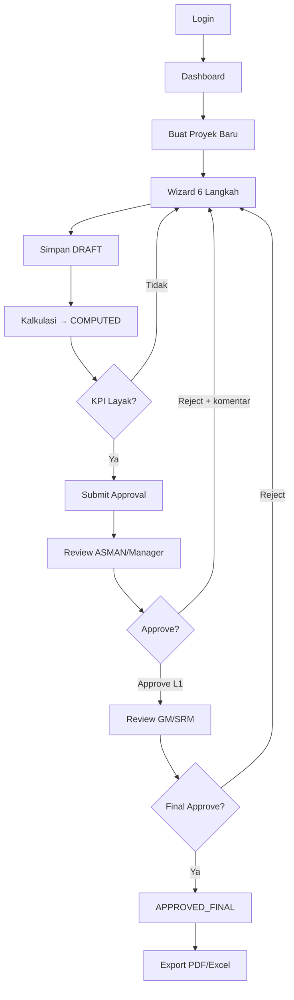
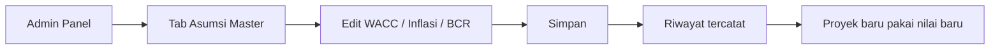
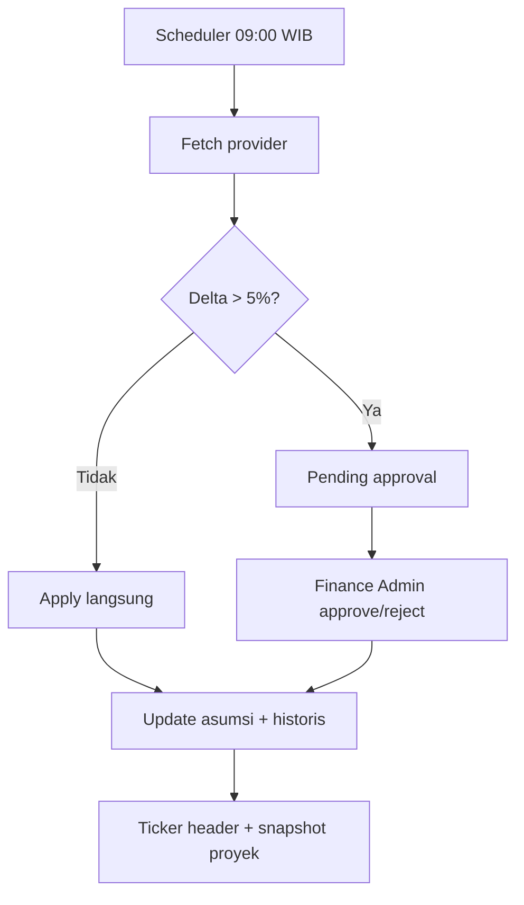
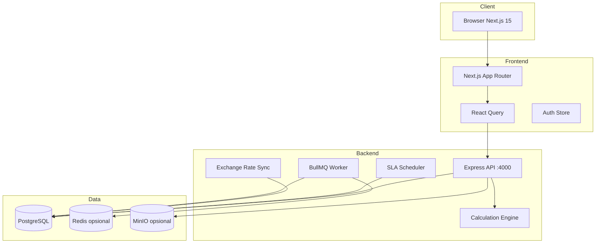

# PRD — NAVPRO (Kajian Kelayakan Finansial)

| Field | Value |
|-------|-------|
| **Produk** | NAVPRO — *Your Compass for Viable Project* |
| **Versi dokumen** | 2.0 |
| **Tanggal** | 2026-06-10 |
| **Status** | Production-ready MVP + Admin CMS v2 |
| **Stack** | Next.js 15 · Express · PostgreSQL · (opsional) Redis/MinIO |

---

## Daftar Isi

1. [Ringkasan Eksekutif](#1-ringkasan-eksekutif)
2. [Masalah & Peluang](#2-masalah--peluang)
3. [Visi, Tujuan & KPI Sukses](#3-visi-tujuan--kpi-sukses)
4. [Persona & Role Pengguna](#4-persona--role-pengguna)
5. [Ruang Lingkup Produk](#5-ruang-lingkup-produk)
6. [Kebutuhan Fungsional](#6-kebutuhan-fungsional)
7. [Kebutuhan Non-Fungsional](#7-kebutuhan-non-fungsional)
8. [Alur Pengguna Utama](#8-alur-pengguna-utama)
9. [Arsitektur & Integrasi](#9-arsitektur--integrasi)
10. [Model Data (Ringkas)](#10-model-data-ringkas)
11. [Keamanan & RBAC](#11-keamanan--rbac)
12. [Status Implementasi Saat Ini](#12-status-implementasi-saat-ini)
13. [Roadmap](#13-roadmap)
14. [Asumsi, Risiko & Dependensi](#14-asumsi-risiko--dependensi)
15. [Glosarium](#15-glosarium)

---

## 1. Ringkasan Eksekutif

**NAVPRO** adalah platform web enterprise untuk **Kajian Kelayakan Finansial (KKF)** proyek investasi. Produk ini menggantikan proses berbasis Excel yang tersebar dengan sistem terpusat yang menstandarkan formula finansial, menyediakan workflow approval digital, audit trail lengkap, dan dashboard portofolio real-time.

### Apa yang NAVPRO lakukan

| Area | Kemampuan |
|------|-----------|
| **Input** | Wizard 6 langkah: identitas proyek → durasi & asumsi → CAPEX → OPEX → revenue/tarif → review & kalkulasi |
| **Kalkulasi** | XIRR, XNPV, BCR/PI, Payback Period, Simple ROI, auto-conclusion (LAYAK / BERSYARAT / TIDAK LAYAK) |
| **Governance** | Multi-level approval, SLA reminder, notifikasi in-app, audit log immutable |
| **Operasional** | CMS Admin tanpa deploy ulang (asumsi, preset, SLA, kurs, user, org unit) |
| **Pelaporan** | Export PDF & Excel, historis versi kalkulasi, dashboard eksekutif |

### Acuan metodologi

Implementasi mengikuti template resmi **`KKF_Proyek_Investasi_1Tahun_v01.xlsx`** dengan perluasan durasi **1–120 bulan**, multi-user, multi-versi, dan fitur enterprise (approval, audit, RBAC).

---

## 2. Masalah & Peluang

### 2.1 Permasalahan saat ini (sebelum NAVPRO)

| # | Masalah | Dampak bisnis |
|---|---------|---------------|
| 1 | File Excel tersebar, tidak terpusat | Versi tidak terkontrol, risiko kehilangan data |
| 2 | Formula tidak terstandarisasi | Hasil kalkulasi berbeda antar tim |
| 3 | Approval manual via email | Tidak ada audit trail, SLA tidak terukur |
| 4 | Tidak ada visibilitas real-time | Manajemen tidak bisa memantau pipeline proyek |
| 5 | Parameter finansial hard-coded di file | Perubahan kebijakan (WACC, BCR) lambat dan rawan error |
| 6 | Kurs valuta manual | Inkonsistensi konversi CAPEX/OPEX multi-mata uang |

### 2.2 Peluang solusi

- **Single source of truth** untuk asumsi finansial dan threshold BCR
- **Traceability penuh** dari input → kalkulasi → approval → export
- **Self-service CMS** untuk Finance Admin mengubah parameter tanpa deployment
- **Isolasi data** per unit organisasi dan segment (RLS PostgreSQL)

---

## 3. Visi, Tujuan & KPI Sukses

### 3.1 Visi

Menjadi platform standar perusahaan untuk evaluasi kelayakan finansial proyek investasi — cepat, konsisten, dan dapat diaudit.

### 3.2 Tujuan produk

1. Mengurangi waktu penyusunan KKF dari hari menjadi jam
2. Menjamin konsistensi formula dengan template Excel resmi (≥ 97% parity)
3. Mempercepat siklus approval dengan SLA terukur dan notifikasi otomatis
4. Memberikan visibilitas portofolio kepada eksekutif dan finance
5. Memungkinkan perubahan parameter global tanpa redeploy aplikasi

### 3.3 KPI sukses (Definition of Done)

| ID | KPI | Target |
|----|-----|--------|
| S1 | Login & RBAC membatasi menu/aksi per role | 100% role demo lulus uji akses |
| S2 | Wizard create + edit proyek DRAFT/COMPUTED/REJECTED | E2E tanpa error validasi |
| S3 | Parity kalkulasi vs Excel template | BCR, XIRR, XNPV, OTC, inflasi compound ≥ 97% match |
| S4 | Workflow submit → review → approve/reject | State machine + audit log lengkap |
| S5 | Dashboard portofolio & approval queue | Data real-time dari API |
| S6 | Export PDF + Excel | Unduh dari UI proyek |
| S7 | CMS Admin ubah asumsi/WACC/SLA | Proyek baru pakai nilai terbaru |
| S8 | Build production lulus | `next build` + API health OK |

---

## 4. Persona & Role Pengguna

### 4.1 Persona

| Persona | Kebutuhan utama | Pain point yang diselesaikan |
|---------|-----------------|------------------------------|
| **Solution Architect / Staff** | Buat proyek, input CAPEX/OPEX/revenue, hitung KPI | Excel manual, tidak ada versioning |
| **Finance Admin** | Kelola asumsi master, kurs, preset, SLA | Perubahan kebijakan butuh IT deploy |
| **Asman / Manager** | Review & approve level 1, pantau SLA | Approval via email, tidak terlacak |
| **GM / SRM** | Persetujuan final, review kelayakan | Tidak ada dashboard pipeline |
| **Super Admin** | Kelola user, audit, system health | Tidak ada audit trail terpusat |
| **Eksekutif / Viewer** | Lihat portofolio & KPI agregat | Data tersebar di banyak file |

### 4.2 Role sistem (RBAC)

| Role | Akses utama |
|------|-------------|
| `SUPER_ADMIN` | Full access: admin panel, user management, maintenance mode |
| `FINANCE_ADMIN` | Admin panel (finansial & operasional), approve kurs pending |
| `SA` / `STAFF` | Buat/edit proyek, submit, kalkulasi |
| `ASMAN` | Approval queue level ASMAN (`IN_REVIEW_ASMAN`) |
| `MANAGER` | Approval queue level Manager |
| `GM_SRM` | Approval final (`APPROVED_L1` → final) |
| `VIEWER` | Read-only dashboard & proyek (scope RLS) |

---

## 5. Ruang Lingkup Produk

### 5.1 In Scope (v2.0)

- Autentikasi JWT + profil user + ganti password
- CRUD proyek KKF dengan wizard 6 langkah
- Engine kalkulasi finansial (sync + async opsional via Redis)
- Versioning snapshot per kalkulasi
- Workflow approval multi-level + reject wajib komentar
- SLA scheduler + notifikasi in-app
- Dashboard portofolio + approval queue
- Export PDF & Excel
- Panel Admin CMS (11 tab)
- Kurs USD/EUR/SGD dengan auto-sync & approval delta >5%
- Row Level Security PostgreSQL (opsional, production)
- Audit log sistem-wide

### 5.2 Out of Scope (v2.0)

- Integrasi ERP/SAP real-time
- Modelling PPh badan, working capital (AR/AP), modal kerja detail
- Mobile native app
- Multi-tenant SaaS publik
- Digital signature legal (e-sign provider)
- Workflow BPMN visual designer

### 5.3 Batasan parameter bisnis

| Parameter | Nilai |
|-----------|-------|
| Durasi proyek | 1 – 120 bulan |
| WACC default | 9,72% p.a. (configurable via CMS) |
| BCR Mandatory | ≥ 1,23 |
| BCR Minimum | ≥ 1,08 |
| Inflasi default | 3,0% p.a. → compound bulanan otomatis |
| PPN default | 12% (referensi, tidak selalu dimodelkan di cashflow) |
| Mata uang input | IDR, USD, EUR, SGD |
| Delta kurs auto-approve | ≤ 5% (configurable) |

---

## 6. Kebutuhan Fungsional

### 6.1 Modul Autentikasi & Profil

| ID | Requirement | Prioritas | Status |
|----|-------------|-----------|--------|
| FR-AUTH-01 | Login email + password, JWT access token | CRITICAL | ✅ |
| FR-AUTH-02 | Session persist + hydrate `/me` | CRITICAL | ✅ |
| FR-AUTH-03 | Update profil (nama lengkap) | MEDIUM | ✅ |
| FR-AUTH-04 | Ganti password (wajib password lama) | HIGH | ✅ |
| FR-AUTH-05 | Rate limit login | HIGH | ✅ |
| FR-AUTH-06 | Logout + invalidasi token | MEDIUM | ✅ |

### 6.2 Modul Manajemen Proyek

| ID | Requirement | Prioritas | Status |
|----|-------------|-----------|--------|
| FR-PROJ-01 | Wizard 6 langkah create proyek baru | CRITICAL | ✅ |
| FR-PROJ-02 | Edit proyek status DRAFT / COMPUTED / REJECTED | HIGH | ✅ |
| FR-PROJ-03 | Duplikasi proyek sebagai template | MEDIUM | ✅ |
| FR-PROJ-04 | Archive / soft-delete proyek | HIGH | ✅ |
| FR-PROJ-05 | Filter & pencarian (status, durasi, teks) | HIGH | ✅ |
| FR-PROJ-06 | Assign unit organisasi & segment | HIGH | ✅ |
| FR-PROJ-07 | Override WACC, inflasi, BCR threshold per proyek | HIGH | ✅ |
| FR-PROJ-08 | Override kurs USD per proyek | MEDIUM | ✅ |
| FR-PROJ-09 | Input CAPEX multi-mata uang dengan konversi ke IDR | HIGH | ✅ |
| FR-PROJ-10 | Katalog OPEX (Icon+ style) | HIGH | ✅ |
| FR-PROJ-11 | Kalkulator tarif revenue (flat / step yearly) | HIGH | ✅ |
| FR-PROJ-12 | OTC (one-time charge) di revenue M1 | MEDIUM | ✅ |

**Wizard 6 langkah (detail):**

| Langkah | Konten |
|---------|--------|
| 1 | Identitas proyek: nama, tanggal kontrak, unit org, pelanggan, PIC |
| 2 | Durasi (preset/custom 1–120 bln), override WACC/inflasi/BCR |
| 3 | CAPEX: item, kategori, amount, periode, mata uang |
| 4 | OPEX: baseline bulanan via katalog + custom |
| 5 | Revenue: mode tarif, kuantitas, harga, OTC |
| 6 | Review ringkasan → Simpan → Kalkulasi |

### 6.3 Modul Engine Kalkulasi

| ID | Requirement | Prioritas | Status |
|----|-------------|-----------|--------|
| FR-CALC-01 | XIRR (Newton-Raphson, max 1000 iter, tol 1e-7) | CRITICAL | ✅ |
| FR-CALC-02 | XNPV exact-date discounting | CRITICAL | ✅ |
| FR-CALC-03 | BCR = PV(revenue M1–MN) / \|CAPEX M0\| | CRITICAL | ✅ |
| FR-CALC-04 | Payback Period (interpolasi linear) | CRITICAL | ✅ |
| FR-CALC-05 | Simple ROI | HIGH | ✅ |
| FR-CALC-06 | OPEX inflation compounding bulanan | CRITICAL | ✅ |
| FR-CALC-07 | Auto-conclusion: LAYAK / BERSYARAT / TIDAK LAYAK | CRITICAL | ✅ |
| FR-CALC-08 | Snapshot versi per kalkulasi (input + hasil JSONB) | CRITICAL | ✅ |
| FR-CALC-09 | Kalkulasi async via BullMQ (opsional) | HIGH | ✅ |
| FR-CALC-10 | Load snapshot versi lama | HIGH | ✅ |
| FR-CALC-11 | Exchange rate snapshot terikat proyek | HIGH | ✅ |

**Aturan conclusion (ringkas):**

| Kondisi BCR | Hasil |
|-------------|-------|
| BCR ≥ mandatory | LAYAK |
| BCR ≥ minimum & < mandatory | BERSYARAT |
| BCR < minimum | TIDAK LAYAK |

### 6.4 Modul Approval & SLA

| ID | Requirement | Prioritas | Status |
|----|-------------|-----------|--------|
| FR-APR-01 | Submit proyek COMPUTED → workflow review | CRITICAL | ✅ |
| FR-APR-02 | Approve level ASMAN → Manager → GM/SRM | CRITICAL | ✅ |
| FR-APR-03 | Reject wajib komentar | CRITICAL | ✅ |
| FR-APR-04 | Approval queue dengan filter Due/Overdue | HIGH | ✅ |
| FR-APR-05 | Notifikasi in-app per event approval | HIGH | ✅ |
| FR-APR-06 | Audit trail immutable per proyek | CRITICAL | ✅ |
| FR-APR-07 | SLA config per role (hari kerja, reminder, escalation) | HIGH | ✅ |
| FR-APR-08 | SLA scheduler server-side + dedup event | HIGH | ✅ |
| FR-APR-09 | Delegasi approval step (v2) | MEDIUM | ✅ |

**Status proyek (state machine):**

```
DRAFT → COMPUTED → SUBMITTED / IN_REVIEW_ASMAN / IN_REVIEW_MANAGER
  → APPROVED_L1 → APPROVED_FINAL
  → REJECTED (kembali editable)
  → ARCHIVED / CANCELLED
```

### 6.5 Modul Dashboard & Pelaporan

| ID | Requirement | Prioritas | Status |
|----|-------------|-----------|--------|
| FR-RPT-01 | Dashboard portofolio: KPI agregat, heatmap risk | CRITICAL | ✅ |
| FR-RPT-02 | Approval queue ringkas di dashboard | HIGH | ✅ |
| FR-RPT-03 | Halaman Approvals dedicated | HIGH | ✅ |
| FR-RPT-04 | Export PDF (print-ready) | HIGH | ✅ |
| FR-RPT-05 | Export Excel .xlsx (Summary + Cashflow) | HIGH | ✅ |
| FR-RPT-06 | Analisis finansial per unit organisasi | MEDIUM | ✅ |
| FR-RPT-07 | Historis kurs USD (`/kurs-usd`) | HIGH | ✅ |
| FR-RPT-08 | FX ticker live di header aplikasi | LOW | ✅ |

### 6.6 Modul Admin CMS (Panel Admin)

Panel admin di `/admin` dengan navigasi tab ber-URL (`?tab=`).

| Tab | Fungsi | Prioritas | Status |
|-----|--------|-----------|--------|
| **Asumsi Master** | WACC, inflasi, BCR, PPN, effective date | CRITICAL | ✅ |
| **Kurs & FX** | Sync USD/EUR/SGD, approve pending, backfill BI | CRITICAL | ✅ |
| **Duration Presets** | Preset 12/24/36/60/120 bln + threshold BCR | HIGH | ✅ |
| **Kategori** | CAPEX & OPEX category codes | HIGH | ✅ |
| **SLA Config** | SLA per role + preview due date | HIGH | ✅ |
| **Notif Templates** | Template pesan NOTIFICATION_TEMPLATE | MEDIUM | ✅ |
| **Organisasi** | Unit Pusat/SBU, segment | HIGH | ✅ |
| **System Config** | Feature flag, formula engine params | HIGH | ✅ |
| **Pengguna** | CRUD user, role, org unit, pagination server | CRITICAL | ✅ |
| **Audit Log** | Jejak aktivitas sistem, pagination server | CRITICAL | ✅ |
| **System Health** | Status DB, KPI operasional, maintenance mode | HIGH | ✅ |

**Prinsip CMS:** perubahan asumsi/preset/SLA berlaku untuk proyek baru atau setelah recalculate — proyek approved tidak otomatis berubah.

### 6.7 Modul Kurs & Valuta Asing

| ID | Requirement | Prioritas | Status |
|----|-------------|-----------|--------|
| FR-FX-01 | Auto-sync kurs harian (scheduler ≥ 09:00 WIB) | HIGH | ✅ |
| FR-FX-02 | Provider configurable (Frankfurter / BI JISDOR backfill) | HIGH | ✅ |
| FR-FX-03 | Pending approval jika delta > threshold (default 5%) | HIGH | ✅ |
| FR-FX-04 | Historis kurs harian di database | HIGH | ✅ |
| FR-FX-05 | Multi-currency: USD, EUR, SGD | HIGH | ✅ |
| FR-FX-06 | Snapshot kurs terikat saat submit/kalkulasi proyek | HIGH | ✅ |
| FR-FX-07 | Validasi min/max kurs (anti data corrupt) | MEDIUM | ✅ |

---

## 7. Kebutuhan Non-Fungsional

### 7.1 Performa

| Requirement | Target |
|-------------|--------|
| Kalkulasi sync proyek ≤ 24 bulan | < 3 detik |
| Load dashboard portofolio | < 2 detik (100 proyek) |
| API health check | < 200 ms |
| Build frontend production | Lulus tanpa error TypeScript/ESLint blocking |

### 7.2 Keamanan

| Requirement | Implementasi |
|-------------|--------------|
| Autentikasi | JWT HS256, secret ≥ 32 char |
| Authorization | RBAC middleware per route |
| Data isolation | PostgreSQL RLS (`NAVPRO_RLS_ENABLED=true`) |
| Transport | HTTPS wajib production |
| Headers | CSP nonce, HSTS, X-Frame-Options (via nginx + Next middleware) |
| Rate limiting | Login endpoint |
| Audit | Semua aksi kritikal tercatat di `audit_logs` |
| Secrets | Tidak di-commit; validasi via `check-secrets` script |

### 7.3 Ketersediaan & Operasional

| Requirement | Target |
|-------------|--------|
| Deployment | PM2 atau Docker Compose on-premise/VPS |
| Maintenance mode | Super Admin bisa blokir non-admin |
| Health monitoring | `/admin?tab=health` + `GET /api/v1/admin/system-health` |
| Backup DB | pg_dump scheduled (operasional IT) |
| Log | PM2 logs + audit log DB |

### 7.4 Usability & UX

| Requirement | Standar |
|-------------|---------|
| Bahasa UI | Bahasa Indonesia |
| Layout admin | Card-based konsisten (`AdminPanelCard`) |
| Responsive | Desktop-first, mobile nav bottom bar |
| Aksesibilitas | Label form, aria pada komponen kritikal |
| Error handling | Toast + inline validation wizard |

### 7.5 Compatibility

| Layer | Versi |
|-------|-------|
| Node.js | LTS (20+) |
| PostgreSQL | 14+ |
| Browser | Chrome/Edge/Firefox/Safari modern |
| Redis | Opsional (BullMQ async) |
| MinIO | Opsional (object storage scaffold) |

---

## 8. Alur Pengguna Utama

### 8.1 Alur create & approve proyek



### 8.2 Alur Finance Admin — ubah asumsi



### 8.3 Alur kurs USD



---

## 9. Arsitektur & Integrasi

### 9.1 Diagram arsitektur



### 9.2 Halaman aplikasi (frontend routes)

| Route | Fungsi |
|-------|--------|
| `/login` | Autentikasi |
| `/dashboard` | Portofolio KPI, heatmap, approval queue ringkas |
| `/projects` | Daftar proyek + filter |
| `/projects/new` | Wizard create |
| `/projects/[id]` | Detail, kalkulasi, approval, export, versi |
| `/projects/[id]/edit` | Edit proyek editable |
| `/approvals` | Approval queue dedicated |
| `/kurs-usd` | Historis & grafik kurs |
| `/admin?tab=*` | Panel admin CMS |

### 9.3 API surface (ringkas)

| Prefix | Modul |
|--------|-------|
| `/api/v1/auth/*` | Login, profil, password |
| `/api/v1/projects/*` | CRUD, calculate, submit, approve, export |
| `/api/v1/dashboard/*` | Portofolio, approval queue |
| `/api/v1/approvals/*` | Queue v2, delegasi |
| `/api/v1/notifications/*` | Notifikasi in-app |
| `/api/v1/config/*` | Assumptions, presets, categories (read) |
| `/api/v1/admin/*` | CMS admin (write) |
| `/api/v1/exchange-rate/*` | Kurs sync, historis, settings |
| `/health` | Health check |

---

## 10. Model Data (Ringkas)

### 10.1 Entitas utama

| Entitas | Deskripsi |
|---------|-----------|
| `users` | Akun, role, org_unit_id |
| `organization_units` | Hierarki Pusat/SBU, segment |
| `projects` | Proyek KKF, status, detail JSONB |
| `calculation_versions` | Snapshot input + hasil per versi |
| `assumptions_master` | Parameter global finansial |
| `assumptions_history` | Audit perubahan asumsi |
| `duration_presets` | Preset durasi + BCR threshold |
| `categories` | Kode CAPEX/OPEX |
| `sla_config` | Konfigurasi SLA per role |
| `sla_events` | Dedup event SLA |
| `audit_logs` | Jejak aktivitas |
| `notifications` | Notifikasi user |
| `system_config` | Key-value config (feature flag, templates) |
| `exchange_rate_history` | Historis kurs harian |
| `exchange_rate_sync_log` | Log sync provider |

### 10.2 Relasi kunci

```
users ──creates──► projects ──has──► calculation_versions
projects ──has──► audit_logs
users ──belongs──► organization_units
sla_config ──governs──► sla_events ◄── projects
assumptions_master ──feeds──► calculation engine
```

---

## 11. Keamanan & RBAC

### 11.1 Matriks akses menu

| Menu | SA/STAFF | ASMAN | MANAGER | GM_SRM | FINANCE_ADMIN | SUPER_ADMIN |
|------|----------|-------|---------|--------|---------------|-------------|
| Dashboard | ✅ | ✅ | ✅ | ✅ | ✅ | ✅ |
| Daftar Proyek | ✅ | ✅ | ✅ | ✅ | ✅ | ✅ |
| Buat Proyek | ✅ | ❌ | ❌ | ❌ | ✅ | ✅ |
| Approvals | ❌ | ✅ | ✅ | ✅ | ✅ | ✅ |
| Kurs USD | ✅ | ✅ | ✅ | ✅ | ✅ | ✅ |
| Admin Panel | ❌ | ❌ | ❌ | ❌ | ✅ | ✅ |

### 11.2 Data visibility (RLS)

| Role | Scope data proyek |
|------|-------------------|
| SUPER_ADMIN, FINANCE_ADMIN, VP_SA | Semua proyek |
| SA, STAFF | Proyek yang dibuat sendiri |
| ASMAN | Proyek di unit organisasi yang sama |
| MANAGER, GM_SRM | Proyek di segment yang sama |

---

## 12. Status Implementasi Saat Ini

### 12.1 Selesai (v2.0)

- ✅ Frontend Next.js 15 + TypeScript + Tailwind + shadcn/ui
- ✅ Backend Express + PostgreSQL + JWT
- ✅ Wizard 6 langkah + validasi FE/BE
- ✅ Engine kalkulasi parity Excel ≥ 97%
- ✅ Workflow approval v2 (ASMAN → Manager → GM/SRM)
- ✅ SLA scheduler + notifikasi
- ✅ Dashboard + approval queue
- ✅ Export PDF & Excel
- ✅ Admin CMS 11 tab dengan UI card seragam
- ✅ Kurs multi-currency + auto-sync + pending approval
- ✅ Server-side pagination (users, audit log)
- ✅ System health panel + maintenance mode
- ✅ FX ticker header (scroll normal, tidak sticky overlay)
- ✅ RLS PostgreSQL (opsional production)

### 12.2 Partial / Opsional

- ⚠️ BullMQ async jobs — aktif hanya jika `REDIS_URL` diset
- ⚠️ MinIO object storage — scaffold, belum dipakai penuh
- ⚠️ Email notifikasi — template ada, SMTP opsional
- ⚠️ Working capital / PPh detail — out of scope v2

### 12.3 Known gaps vs Excel template

| Item | Status |
|------|--------|
| PPh Badan / PPh 23 di cashflow | Tidak dimodelkan (info only) |
| AR/AP (umur piutang/hutang) | Tidak dimodelkan |
| Payback integer vs desimal | App lebih presisi (desimal) |

---

## 13. Roadmap

### Fase D — Operasional & hardening (berikutnya)

| Item | Prioritas |
|------|-----------|
| CI/CD pipeline (build + smoke test otomatis) | HIGH |
| Email notifikasi approval (SMTP production) | HIGH |
| Redis/BullMQ default di Docker Compose production | MEDIUM |
| Hardening RLS di semua route sensitif | HIGH |
| E2E test Playwright (login → wizard → approve) | MEDIUM |

### Fase E — Enterprise extension

| Item | Prioritas |
|------|-----------|
| Integrasi SSO/LDAP | MEDIUM |
| BI JISDOR sebagai provider utama (bukan Frankfurter) | MEDIUM |
| Bulk import proyek dari Excel | LOW |
| Custom report builder | LOW |
| API webhook untuk ERP | LOW |

---

## 14. Asumsi, Risiko & Dependensi

### 14.1 Asumsi

- PostgreSQL tersedia dan di-backup rutin
- Finance menetapkan kebijakan WACC, BCR, dan inflasi resmi
- User memiliki browser modern dan koneksi stabil
- VPS/production menggunakan HTTPS + nginx reverse proxy
- Password demo diatur via `SEED_DEMO_PASSWORD` env (bukan hardcode)

### 14.2 Risiko

| Risiko | Dampak | Mitigasi |
|--------|--------|----------|
| Provider kurs down | Kurs stale | Fallback kurs lama + alert admin |
| Delta kurs ekstrem | Keputusan investasi salah | Pending approval + min/max validation |
| Perubahan formula tanpa testing | Hasil KPI salah | Version snapshot + audit + UAT vs Excel |
| Bug bypass RBAC | Data bocor antar unit | RLS di DB + review middleware |
| Maintenance mode lupa dimatikan | User terblokir | Health panel + Super Admin only |

### 14.3 Dependensi eksternal

| Dependensi | Penggunaan |
|------------|------------|
| Frankfurter API | Auto-sync kurs USD/EUR/SGD |
| Bank Indonesia JISDOR | Backfill historis (manual trigger) |
| PostgreSQL | Database utama |
| Redis (opsional) | Async job queue |
| nginx | Reverse proxy + SSL termination |

---

## 15. Glosarium

| Istilah | Definisi |
|---------|----------|
| **KKF** | Kajian Kelayakan Finansial — analisis investasi proyek |
| **CAPEX** | Capital Expenditure — pengeluaran modal |
| **OPEX** | Operational Expenditure — biaya operasional |
| **WACC** | Weighted Average Cost of Capital — discount rate tahunan |
| **XIRR** | Extended Internal Rate of Return — tingkat return annualized |
| **XNPV** | Extended Net Present Value — nilai kini bersih |
| **BCR** | Benefit-Cost Ratio / Profitability Index |
| **OTC** | One-Time Charge — pendapatan sekali di awal |
| **SLA** | Service Level Agreement — batas waktu approval |
| **RLS** | Row Level Security — isolasi data di PostgreSQL |
| **CMS** | Content Management System — panel admin parameter |
| **Preset** | Template durasi proyek dengan threshold BCR bawaan |
| **Snapshot** | Salinan immutable input+hasil kalkulasi per versi |

---

## Lampiran

| Dokumen | Path | Keterangan |
|---------|------|------------|
| README operasional | `docs/README.md` | Setup & endpoint |
| PRD v1.2 (legacy) | `docs/htj.md` | Acuan historis |
| Traceability FR → API | `docs/TRACEABILITY.md` | Mapping requirement |
| Plan penyempurnaan | `docs/PLAN_PENYEMPURNAAN.md` | Roadmap eksekusi |
| Parity vs Excel | `docs/exsum.md` | Validasi formula |
| RLS | `docs/RLS_NAVPRO.md` | Kebijakan isolasi data |
| Kurs USD spec | `docs/usd.md` | Spesifikasi modul FX |
| Demo login | `docs/DEMO_LOGIN.md` | Akun seed |
| Security | `docs/SECURITY.md` | Env & secrets |
| VPS deploy | `docs/PENTEST_REMEDIATION.md` | Langkah deploy PM2 |

---

*Dokumen ini mencerminkan kondisi codebase NAVPRO per commit `main` (Juni 2026). Perbarui versi dokumen saat ada perubahan scope produk signifikan.*
