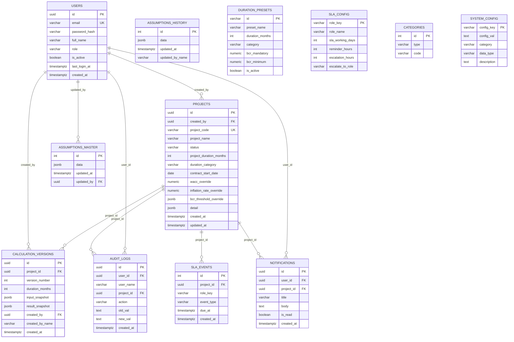
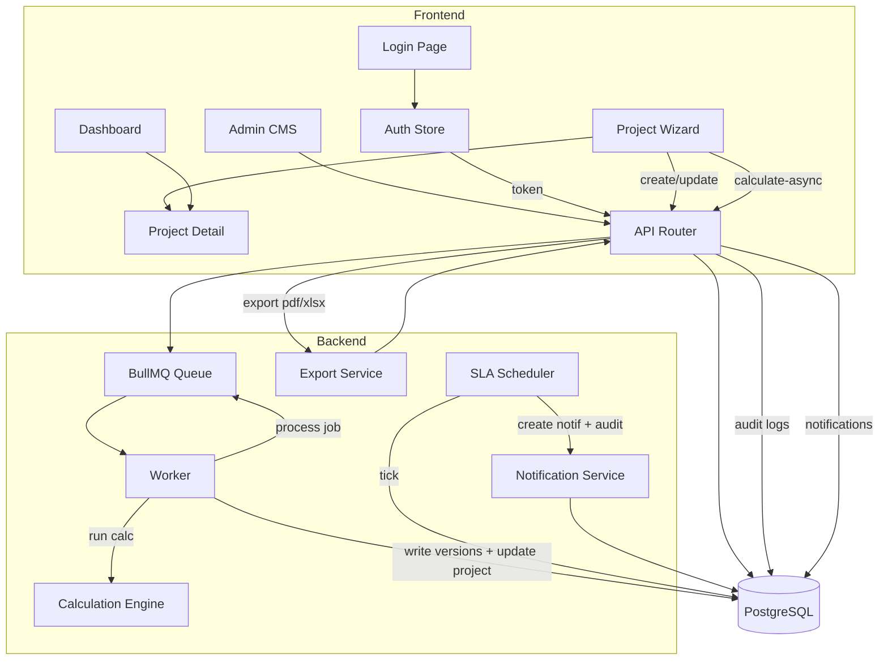
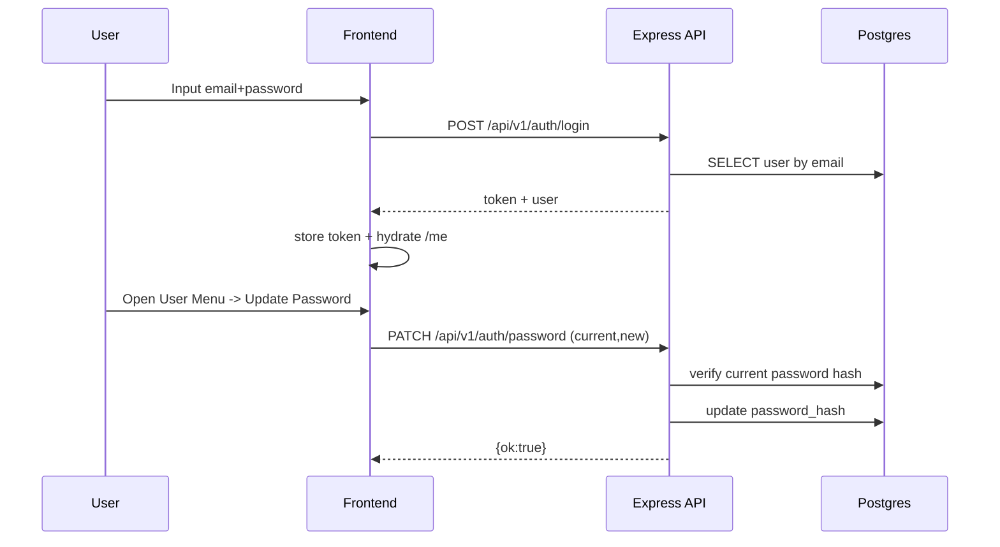

## Diagram NAVPRO (Mermaid)

Dokumen ini berisi diagram arsitektur dan relasi data NAVPRO menggunakan Mermaid.

---

### 1) ERD (Entity Relationship Diagram)



Catatan:
- `PROJECTS.detail` menyimpan struktur domain (CAPEX/OPEX/Revenue, approval_chain, kpi, cashflow_monthly, dll) sebagai JSONB.
- `SLA_EVENTS` digunakan untuk menandai event reminder/escalation agar tidak dobel.

---

### 2) DFD Level 0 (Context Diagram)

```mermaid
flowchart LR
  U[User / Role-based Actor] -->|Login / CRUD Proyek / Submit| WEB[Next.js Frontend]
  WEB -->|REST JSON| API[Express API]
  API -->|SQL| DB[(PostgreSQL)]
  API -->|Enqueue calc job| Q[(Redis/BullMQ)]
  W[Worker] -->|Dequeue + Process KPI| Q
  W -->|SQL update result| DB
  API -->|Send email (optional)| SMTP[(SMTP Server)]
  API -->|Presign URL + Upload (optional)| OBJ[(MinIO/S3)]
  WEB -->|Download export| API
```

---

### 3) DFD Level 1 (Proses utama)



---

### 4) Sequence (Auth + Change Password)



