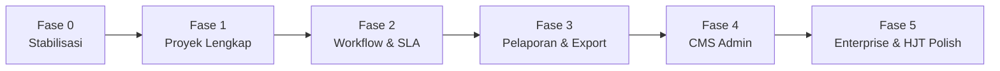

# Rencana Penyempurnaan NAVPRO — Next.js Enterprise Grade

**Versi dokumen:** 1.0  
**Tanggal:** 2026-05-28  
**Acuan:** `docs/htj.md` (PRD), `docs/exsum.md`, `docs/README.md`, `KKF_Proyek_Investasi_1Tahun_v01.xlsx`, referensi UI/UX **HJT** (`~/project/hjt`)  
**Status eksekusi:** 2026-05-28

- **Batch A**: **selesai** (Fase 0–2)
- **Batch B**: **selesai** (Fase 3) — PDF/XLSX export dasar
- **Batch C**: **selesai** (Fase 4) — CMS inti + system config + templates
- **Batch D**: menunggu arahan

---

## 1. Tujuan & Kriteria Sukses

### 1.1 Tujuan

Mengubah NAVPRO dari aplikasi HTML statis (legacy/HJT) menjadi **platform KKF enterprise** dengan:

- Frontend **Next.js 14 + TypeScript** (sesuai PRD §9)
- Backend **Express + PostgreSQL** yang sudah ada (tetap dipakai; migrasi Fastify/Prisma opsional di fase jauh)
- **Paritas fungsional ≥ HJT** + gap Excel yang masih relevan (exsum §7)
- Siap **on-premise / Docker** untuk lingkungan korporat

### 1.2 Kriteria sukses (Definition of Done per fase)

| # | Kriteria | Verifikasi |
|---|----------|------------|
| S1 | User dapat login JWT, RBAC membatasi menu & aksi | Test 6 role demo |
| S2 | Wizard 6 langkah create + edit DRAFT/COMPUTED/REJECTED | E2E manual + validasi API |
| S3 | Kalkulasi KPI identik standar Excel (BCR, XIRR, OTC, inflasi) | Bandingkan 1 proyek sample vs template xlsx |
| S4 | Workflow Submit → Manager → GM/SRM + reject wajib komentar | State machine + audit log |
| S5 | Dashboard portofolio + heatmap + chart ≈ HJT | Side-by-side screenshot |
| S6 | Export PDF + Excel cashflow | File unduh dari UI |
| S7 | CMS Admin dapat mengubah asumsi/preset/SLA tanpa deploy | Finance Admin ubah WACC → proyek baru pakai nilai baru |
| S8 | Build production lulus (`next build`, API health) | CI lokal / pipeline |

---

## 2. Baseline — Sudah vs Belum (per 2026-05-28)

### 2.1 Sudah ada (foundation sprint — selesai)

| Area | Item | Catatan |
|------|------|---------|
| **Frontend** | Next.js 14, Tailwind, shadcn, React Query, Zustand | `frontend/` |
| **Auth** | Login API, token persist, hydrate `/me` | Bukan mock |
| **Layout** | AppShell: Dashboard, Projects, Approvals, Admin | Mirip navigasi HJT |
| **Dashboard** | KPI cards, risk heatmap, chart CAPEX/OPEX/Revenue, queue ringkas | Data dari `/dashboard/portfolio` |
| **Projects** | List + filter, detail KPI + cashflow table | |
| **Wizard** | 6 langkah create/edit, preset API, BCR override, autosave, async calc | `ProjectWizard.tsx` |
| **Approval** | Queue + timeline + reject modal + RBAC tombol | `ApprovalChain.tsx` |
| **Admin** | CMS Admin (assumptions, presets, SLA, kategori, users, audit, health, system config, templates) | `/admin` tabbed |
| **Proyek** | Duplikasi, archive, filter durasi/kategori, version snapshot, cashflow chart, audit log | Batch A |
| **Backend** | Engine kalkulasi v1.8, CRUD, workflow, SLA scheduler, BullMQ scaffold | `backend/` |
| **Dokumen** | PRD, exsum, README | |

### 2.2 Belum / parsial (target penyempurnaan)

| Area | Gap | Prioritas PRD |
|------|-----|---------------|
| Validasi Zod di wizard | FR mirror validate.js | MEDIUM |
| Notifikasi email (SMTP nyata) | FR-APR-05 | HIGH — scaffold log saja |
| Verifikasi SLA overdue konsisten | P2-10 | MEDIUM |
| Export PDF lebih rapi (template sesuai exsum) | FR-RPT-01 | MEDIUM |
| Export XLSX parity penuh dengan template | FR-RPT-02 / exsum F3-04 | MEDIUM |
| Executive summary lengkap A–D (exsum §5.3) | exsum §5.3 | MEDIUM |
| CMS lanjutan: notification template editor, system config grouped | htj §11 | MEDIUM |
| Template notifikasi editor | CMS-06 | MEDIUM |
| System health tiles + maintenance | CMS-12 | MEDIUM |
| Offline fallback localStorage | README MVP | MEDIUM |
| UI pixel-parity HJT (CSS, chart tipe, approval timeline) | — | MEDIUM |
| Template RAB 8-item Lastmile | exsum F3-01 | MEDIUM |
| Kurs USD di CMS + override proyek | exsum §2.1 | LOW |
| Docker Compose 7 service (PRD §10.3) | Infra | MEDIUM |
| Test otomatis (engine + API) | NFR | MEDIUM |
| Fastify + Prisma (stack PRD ideal) | — | **Deferred** |

---

## 3. Fase Penyempurnaan (Roadmap)



| Fase | Nama | Durasi estimasi | Outcome utama |
|------|------|-----------------|---------------|
| **0** | Stabilisasi & fondasi | 2–3 hari | Env, regresi, hapus dead code, `.env`, README dev |
| **1** | Siklus proyek lengkap | 5–7 hari | Edit wizard, preset, validasi, versioning UI |
| **2** | Workflow & operasional | 4–5 hari | Approval chain visual, async calc, notifikasi |
| **3** | Pelaporan KKF | 4–6 hari | PDF executive summary + Excel cashflow |
| **4** | CMS Admin | 5–7 hari | Form CRUD sesuai htj §11 (bukan JSON viewer) |
| **5** | Enterprise polish | 5–8 hari | Docker, offline, HJT UI parity, RAB template, tests |

**Total estimasi:** ~25–36 hari kerja (1 dev) — dapat diparalelkan frontend/backend.

---

## 4. Tasklist per Fase

Legenda status: `[ ]` belum | `[~]` parsial | `[x]` selesai

### Fase 0 — Stabilisasi & fondasi

| ID | Task | Owner | Deps | FR/Ref |
|----|------|-------|------|--------|
| P0-01 | `[x]` Struktur route `(dashboard)` + redirect legacy `/dashboard/projects/*` | FE | — | — |
| P0-02 | `[x]` Dokumentasi dev: `frontend/README` + root quickstart selaras `docs/README` | FE | — | README |
| P0-03 | `[~]` Docker compose — **ditunda**; dokumentasi Postgres lokal di `docs/README` | DevOps | — | htj §10.5 |
| P0-04 | `[x]` Smoke test script: health + login + list projects | BE | — | `npm run smoke` |
| P0-05 | `[x]` Hapus/arsipkan `ProjectList.tsx` mock & dead code frontend | FE | — | — |
| P0-06 | `[x]` Matriks traceability FR → endpoint → halaman | PM | — | `docs/TRACEABILITY.md` |

**Gate Fase 0:** `npm run build` (FE) + `npm test` (BE jika ada) + seed demo jalan.

---

### Fase 1 — Siklus proyek lengkap

| ID | Task | Owner | Deps | FR/Ref |
|----|------|-------|------|--------|
| P1-01 | `[x]` Wizard create 6 langkah + API calculate | FE | — | FR-PROJ-01 |
| P1-02 | `[x]` **Edit wizard** untuk proyek DRAFT/COMPUTED/REJECTED (`/projects/[id]/edit`) | FE | P1-01 | FR-PROJ-02 |
| P1-03 | `[x]` Autosave draft (debounce) ke API + indikator simpan | FE | P1-02 | HJT |
| P1-04 | `[x]` Load **duration presets** & **assumptions** dari `/api/v1/config/*` di step 2 | FE | — | FR-CONFIG-06 |
| P1-05 | `[x]` Override BCR threshold per proyek di wizard (mandatory/minimum) | FE | P1-04 | FR-CONFIG-05 |
| P1-06 | `[x]` Filter proyek: durasi, kategori, status, search | FE | — | FR-PROJ-05 |
| P1-07 | `[x]` Duplikasi proyek → proyek baru DRAFT | FE+BE | P1-02 | FR-PROJ-03 |
| P1-08 | `[x]` Cancel/archive proyek dari UI + konfirmasi | FE | — | FR-PROJ-04 |
| P1-09 | `[x]` **Version history UI**: daftar versi + Load Snapshot ke detail | FE | — | README MVP |
| P1-10 | `[x]` Chart cashflow di halaman detail | FE | P1-09 | htj §4.1 |
| P1-11 | `[x]` Validasi Zod mirror `validate.js` di wizard (FE) | FE | — | NFR |

**Gate Fase 1:** Buat → edit → hitung ulang → lihat 3 versi snapshot tanpa error.

---

### Fase 2 — Workflow, SLA & kalkulasi async

| ID | Task | Owner | Deps | FR/Ref |
|----|------|-------|------|--------|
| P2-01 | `[x]` Submit / approve / reject di detail proyek | FE | — | FR-APR-01–04 |
| P2-02 | `[x]` Komponen **ApprovalChain** timeline (visual HJT) | FE | P2-01 | HJT |
| P2-03 | `[x]` Modal reject dengan validasi komentar wajib | FE | P2-01 | FR-APR-04 |
| P2-04 | `[x]` Role-based visibility tombol (Manager vs GM vs SA) | FE | — | htj §4.2 |
| P2-05 | `[x]` Integrasi `POST /calculate-async` + polling `GET /jobs/:id` | FE+BE | Redis opsional | FR-CALC-06 |
| P2-06 | `[x]` Progress indicator wizard step 6 (queued → running → done) | FE | P2-05 | htj §5.1 |
| P2-07 | `[x]` In-app notifications (bell) | FE | — | FR-APR-05 |
| P2-08 | `[x]` Email notifikasi — SMTP via Nodemailer (fallback log jika env belum ada) | BE | — | FR-APR-05 |
| P2-09 | `[x]` Audit log di detail proyek | FE | — | FR-APR-06 |
| P2-10 | `[x]` Verifikasi SLA scheduler + badge overdue konsisten approvals/dashboard | FE+BE | — | README |

**Gate Fase 2:** Alur SUBMITTED → APPROVED_FINAL dengan 2 role berbeda; async calc untuk proyek 120 bulan.

---

### Fase 3 — Pelaporan & export (Excel parity)

| ID | Task | Owner | Deps | FR/Ref |
|----|------|-------|------|--------|
| P3-01 | `[x]` Halaman/section **Executive Summary** di detail | FE | P1-09 | exsum |
| P3-02 | `[x]` Export **PDF** (endpoint backend) | BE+FE | P3-01 | FR-RPT-01 |
| P3-03 | `[x]` Export **.xlsx** cashflow (`07_Cashflow`) | BE+FE | — | FR-RPT-02 |
| P3-04 | `[x]` Sheet `08_Ringkasan` (identitas + KPI) di workbook export | BE | P3-03 | sheet 08 |
| P3-05 | `[x]` Tombol export di detail | FE | P3-02–03 | FR-RPT-04 |
| P3-06 | `[x]` MinIO pre-signed URL (opsional) atau download langsung | BE | — | htj §9 |

**Gate Fase 3:** Unduh PDF + xlsx untuk proyek demo; angka KPI = UI.

---

### Fase 4 — CMS Admin (htj §11)

| ID | Task | Owner | Deps | FR/Ref |
|----|------|-------|------|--------|
| P4-01 | `[~]` Routing `/admin` dengan tab | FE | — | §11.11 |
| P4-02 | `[x]` **CMS-01** Assumption Master — form edit + history | FE | — | CMS-01 |
| P4-03 | `[x]` **CMS-02** Duration Preset CRUD | FE | — | CMS-02 |
| P4-04 | `[x]` **CMS-03** SLA Config per role | FE | — | CMS-03 |
| P4-05 | `[x]` **CMS-04/05** Kategori CAPEX & OPEX | FE | — | CMS-04/05 |
| P4-06 | `[x]` **CMS-10** User management (create/edit) | FE | — | CMS-10 |
| P4-07 | `[x]` **CMS-11** Audit log viewer + filter (basic) | FE | — | CMS-11 |
| P4-08 | `[x]` **CMS-12** System health dashboard + maintenance toggle | FE | — | CMS-12 |
| P4-09 | `[x]` **CMS-06** Notification template editor (system_config) | FE | P4-08 | CMS-06 |
| P4-10 | `[x]` **CMS-09** System config grouped (formula, security, flags) | FE | — | CMS-09 |

**Gate Fase 4:** Finance Admin ubah WACC; proyek baru pakai asumsi baru; Super Admin kelola user.

---

### Fase 5 — Enterprise polish & paritas HJT

| ID | Task | Owner | Deps | FR/Ref |
|----|------|-------|------|--------|
| P5-01 | `[x]` Mode **offline** — localStorage fallback projects (port dari HJT `index.js`) | FE | — | README |
| P5-02 | `[x]` Role simulator (dev only) seperti HJT | FE | P5-01 | HJT |
| P5-03 | `[x]` Template **RAB 8-item** Lastmile sebagai starter CAPEX | FE | — | exsum F3-01 |
| P5-04 | `[x]` Kurs USD/IDR di CMS + override proyek | FE+BE | P4-02 | exsum §2.1 |
| P5-05 | `[x]` UI polish: tipografi, kartu KPI, heatmap CSS, animasi pulse queue | FE | — | HJT `index.css` |
| P5-06 | `[x]` Cost/Revenue chart — toggle bar/pie/line + perbandingan proyek | FE | — | HJT |
| P5-07 | `[x]` Docker Compose: nginx, frontend, backend, worker, postgres, redis, minio | DevOps | P2-05 | htj §10.3 |
| P5-08 | `[ ]` Test: `calculationEngine.test.js` extended + API integration tests | BE | — | NFR |
| P5-09 | `[ ]` E2E Playwright: login → create → calculate → submit | QA | P1–2 | — |
| P5-10 | `[ ]` Security pass: refresh token, idle timeout, rate limit (nginx) | BE | — | htj §11.7 |

**Gate Fase 5:** Deploy staging via Docker; sign-off UAT vs checklist exsum §3.

---

## 5. Prioritas Eksekusi (urutan yang disarankan)

Jika Anda ingin nilai bisnis cepat, eksekusi per **batch**:

| Batch | Fase | Alasan |
|-------|------|--------|
| **A** (wajib) | 0 → 1 → 2 | Core KKF operasional harian |
| **B** (laporan) | 3 | Pengganti Excel untuk presentasi |
| **C** (operasi IT) | 4 | Parameter tanpa deploy |
| **D** (production) | 5 | Offline, Docker, QA |

Anda dapat mengatakan misalnya: *"jalankan Batch A dulu"* atau *"P1-02 dan P3-03 saja"*.

---

## 6. Pemetaan Gap Excel (exsum) → Fase

| Gap exsum | Fase | Task |
|-----------|------|------|
| Export .xlsx | 3 | P3-03 |
| Template RAB 8-item | 5 | P5-03 |
| Koefisien OPEX % | 1 | Sudah di engine; expose di wizard ✓ |
| Harsat & Qty | 1 | Sudah di wizard ✓ |
| Ringkasan investasi agregat | 3 | P3-01 |
| Kurs USD/IDR | 5 | P5-04 |
| Lokasi pelanggan | 1 | Sudah di wizard ✓ |

---

## 7. Stack & keputusan arsitektur (tetap)

| Layer | Keputusan | Alternatif (tidak di fase ini) |
|-------|-----------|-------------------------------|
| Frontend | **Next.js 14** App Router | — |
| Backend | **Express** existing | Fastify + Prisma (PRD jangka panjang) |
| DB | PostgreSQL | — |
| Queue | BullMQ + Redis (opsional) | — |
| File | MinIO (fase 3+) | S3 |
| Auth | JWT (HS/RS sesuai deploy) | NextAuth wrapper opsional |

---

## 8. Risiko & mitigasi

| Risiko | Dampak | Mitigasi |
|--------|--------|----------|
| Paritas angka Excel vs engine | Kepercayaan user | Golden test 1 proyek dari `KKF_Proyek_Investasi_1Tahun_v01.xlsx` |
| Scope CMS terlalu besar | Delay | Fase 4b untuk template notifikasi; form dulu, rich editor belakangan |
| Async calc tanpa Redis | Fitur mati | Fallback sync tetap ada (sudah) |
| UI HJT 1:1 memakan waktu | Delay polish | Fase 5 terakhir; fungsi dulu |

---

## 9. Cara Anda mengarahkan eksekusi

Setelah membaca dokumen ini, balas dengan format bebas, contoh:

1. **Batch:** `A saja` / `A + B` / `semua fase berurutan`
2. **Prioritas kustom:** `P1-02, P3-03, P4-02`
3. **Batasan:** `tanpa Docker` / `tanpa email` / `deadline 1 minggu`
4. **UI:** `ikut HJT ketat` / `modern minimal cukup`

Saya akan mengeksekusi **hanya** task yang Anda setujui, menandai `[x]` di dokumen ini per penyelesaian.

---

## 10. Diagram (Mermaid): ERD, DFD, Sequence

Diagram arsitektur dan relasi data tersedia di:

- `docs/DIAGRAMS.md`

(*Catatan: file HTML viewer juga akan merender Mermaid untuk file ini jika Anda buka via preview/editor.*)

---

## 10. Lampiran — Checklist singkat (copy untuk tracking)

```
Fase 0  [x] P0-02  [~] P0-03  [x] P0-04  [x] P0-05  [x] P0-06
Fase 1  [x] P1-02  [x] P1-03  [x] P1-04  [x] P1-05  [x] P1-06  [x] P1-07  [x] P1-08  [x] P1-09  [x] P1-10  [x] P1-11
Fase 2  [x] P2-02  [x] P2-03  [x] P2-04  [x] P2-05  [x] P2-06  [x] P2-08  [x] P2-09  [x] P2-10
Fase 3  [x] P3-01  [x] P3-02  [x] P3-03  [x] P3-04  [x] P3-05  [x] P3-06
Fase 4  [x] P4-02  [x] P4-03  [x] P4-04  [x] P4-05  [x] P4-06  [x] P4-07  [x] P4-08  [x] P4-09  [x] P4-10
Fase 5  [x] P5-01  [x] P5-02  [x] P5-03  [x] P5-04  [x] P5-05  [x] P5-06  [x] P5-07  [ ] P5-08  [ ] P5-09  [ ] P5-10
```

---

*Dokumen ini adalah single source of truth untuk penyempurnaan NAVPRO hingga Anda mengubah prioritas.*
