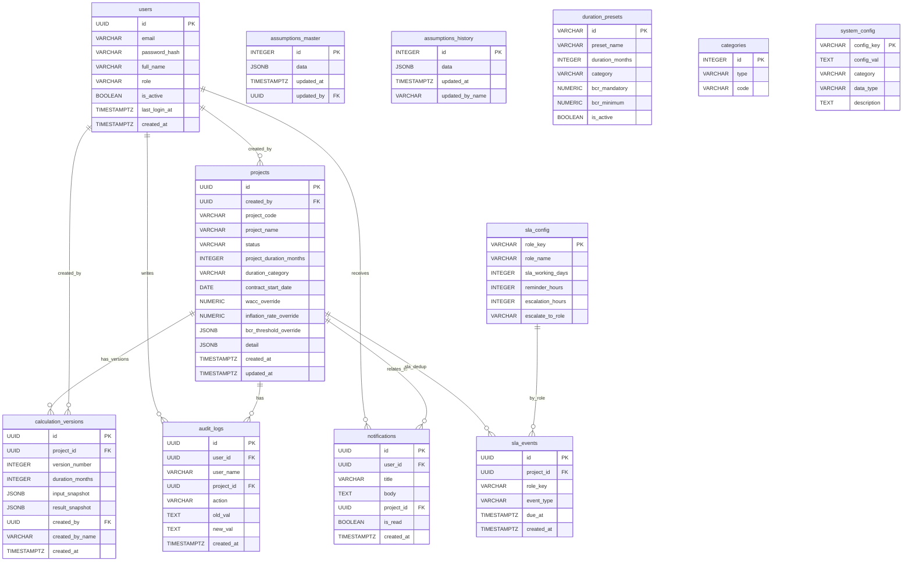

# NAVPRO — Kajian Kelayakan Finansial

NAVPRO adalah aplikasi web untuk **kajian kelayakan finansial** proyek/investasi: input CAPEX/OPEX/Revenue, hitung KPI (XIRR, XNPV, BCR, Payback), versioning hasil kalkulasi, export laporan, dan workflow approval berbasis role.

Dokumen ini menggambarkan **kondisi implementasi saat ini** (MVP) di repo ini.

---

## Fitur utama (MVP saat ini)

- **Wizard 6 langkah** pembuatan/edit proyek + validasi kuat (FE+BE)
- **Kalkulasi finansial** (cashflow bulanan + KPI)
- **Version history**: snapshot input+hasil per kalkulasi (`calculation_versions`) + UI Load Snapshot (online/API)
- **Export**:
  - PDF (print stylesheet rapi)
  - Excel `.xlsx` (SheetJS)
- **Workflow approval**: submit → manager → GM/SRM, reject dengan komentar wajib
- **Approval Queue**:
  - Dashboard queue ringkas
  - Halaman `Approvals` khusus (filter Due/Overdue, status, cari)
  - Approve/Reject langsung dari tabel
- **SLA reminder server-side** + escalation + notifikasi in-app (berdasarkan `sla_config`, dedup via `sla_events`)
- **Mode offline**: fallback `localStorage` jika API tidak tersedia

---

## Arsitektur (kondisi sekarang)

| Layer | Teknologi | Port |
|---|---|---|
| Frontend | Static HTML/CSS/JS (Chart.js, SheetJS) | 3000 |
| Backend API | Node.js + Express 4 + JWT | 4000 |
| Database | PostgreSQL | 5432 |
| Queue (opsional) | Redis + BullMQ | 6379 |

Catatan:
- BullMQ **sudah di-scaffold**, namun baru aktif jika environment variable `REDIS_URL` diset.
- Kalkulasi sinkron masih tersedia di `POST /api/v1/projects/:id/calculate`.

---

## ERD (Mermaid)



---

## Instalasi & Menjalankan (kondisi sekarang)

### Prasyarat

- Node.js (disarankan versi LTS modern)
- PostgreSQL (local atau via Docker Compose)
- (Opsional) Redis jika ingin mengaktifkan BullMQ async jobs

### 1) Jalankan database PostgreSQL

Jika memakai Docker:

```bash
docker compose up -d postgres
```

Atau PostgreSQL lokal (Homebrew) — buat role & database jika belum ada:

```bash
# Ganti YOUR_DB_PASSWORD dengan secret lokal Anda
psql -d postgres -c "CREATE ROLE navpro WITH LOGIN PASSWORD 'YOUR_DB_PASSWORD' CREATEDB;"
psql -d postgres -c "CREATE DATABASE navpro_db OWNER navpro;"
```

Salin `backend/.env.example` → `backend/.env` dan set `DATABASE_URL` (serta `SEED_DEMO_PASSWORD`, `JWT_SECRET`). Lihat [SECURITY.md](./SECURITY.md).

Smoke test API (setelah `npm start`):

```bash
cd backend && npm run smoke
```

### 2) Setup & jalankan Backend API

```bash
cd backend
cp .env.example .env # jika belum ada
npm install
npm run seed          # seed awal (users, assumptions, sla_config, dll)
npm run seed:demo     # tambah demo project (optional)
npm start
```

Backend berjalan di `http://localhost:4000`, health check `GET /health`.

#### Mengaktifkan BullMQ async jobs (opsional)

Jalankan Redis, lalu set env:

```bash
export REDIS_URL="redis://localhost:6379"
cd backend
npm start
```

Endpoint kalkulasi async:
- `POST /api/v1/projects/:id/calculate-async` → enqueue job (HTTP 202)

### 3) Jalankan Frontend (Next.js)

```bash
cd frontend
cp .env.example .env.local
npm install
npm run dev
```

Buka `http://localhost:3000`.

---

## Akun development (setelah seed)

Kredensial **tidak** disimpan di repo. Set `SEED_DEMO_PASSWORD` di `backend/.env`, jalankan `npm run seed`, lalu login dengan email user yang dibuat seed dan password dari env Anda.

Detail: [SECURITY.md](./SECURITY.md)

---

## Endpoint penting (ringkas)

- `GET /health` — health check
- `POST /api/v1/auth/login` — login (JWT)
- `GET|POST|PUT|DELETE /api/v1/projects` — CRUD proyek
- `POST /api/v1/projects/:id/calculate` — kalkulasi sinkron + snapshot versi
- `POST /api/v1/projects/:id/calculate-async` — kalkulasi async (butuh `REDIS_URL`)
- `POST /api/v1/projects/:id/submit|approve|reject` — workflow approval (reject wajib comment)
- `GET /api/v1/dashboard/portfolio` — KPI dashboard
- `GET /api/v1/dashboard/approval-queue` — data approvals page (SLA start/due)
- `GET /api/v1/notifications` — notifikasi
- `GET /api/v1/admin/*` — CMS (asumsi, preset, SLA, user, audit)

---

## Dump database

Jika butuh dump SQL untuk backup/dev:
- file dump ada di folder `db/` (contoh: `db/navpro_db_YYYYMMDD_HHMMSS.sql`)

